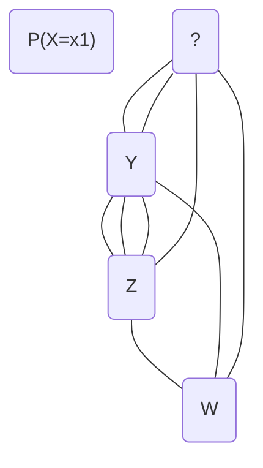

# Summary of probability for machine learning ebook from jason


## What it will teach


It will teach the basics of probability needed as a machine learning
practitioner. In detail, it will teach:


- How the field of probability relates to machine learning and how to apply that
  probabilistic thinking on a machine learning project.
- How to calculate different types of probability, such as:
	- *joint probability*
	- *marginal probability*
	- *conditional probability*
- How to consider data in terms of random variables and how to recognize and
  sample from common discrete and continuous probability distributions
  functions.
- How to frame learning as maximum likelihood estimation and how this important
  probabilistic framework is used for regression, classification and clustering
  machine learning algorithms.
- How to use probabilistic methods to evaluate machine learning models directly
  without evaluating their performance on a test dataset.
- How to calculate and consider probability from the Bayesian perspective and to
  calculate *conditional probability* with Bayes Theorem for common scenarios.
- How to use the statement of the Bayes Theorem about *conditional probability*
  for classification with Naive Bayes, optimisation with Bayes Optimisation and
  graphical models with Bayesian Networks.
- How to quantify uncertainty using measures of information and entropy from the
  field of information theory and calculate quantities such as cross-entropy and
  mutual information.
- How to develop and evaluate naive classifiers using a probabilistic framework.
- How to evaluate classification models that predict probabilities and calibrate
  probability predictions.


How it will impact the machine learning process:


- It will let one confidently calculate and wield both frequentist probability
  (counts) and Bayesian probability (beliefs) generally and within the context
  of machine learning datasets.
- Confidently select and use loss functions and performance measures when
  training machine learning algorithms, backed by a knowledge of the underlying
  probabilistic framework
  (e.g. maximum likelihood estimation) and the relationships between metrics.
  (e.g. cross-entropy and negative *log-likelihood*).
- One will have the ability to confidently evaluate classification predictive
  models, including establishing a robust baseline in performance, probabilistic
  performance measures, and calibrated predicted probabilities.

we jlol here.

How to best utilize this material:

> This book is not intended to be read passively or be placed in a folder as a
> reference text. It is a playbook, a workbook, and a guidebook intended for you
> to learn by doing and then applying your new understanding with working Python
> examples. To get the most out of the book, I would recommend playing with the
> examples in each tutorial. Extend them, break them, then fix them. Try some
> extensions presented at the end of each lesson and let me know how you do.


## Chapter Overview


### Part 1 - Foundation


Introduction


### Part 2 - Basics


Different types of probability.


- *marginal probability*
- *joint probability*
- *conditional probability*


Learn how to calculate each one of them.


### Part 3 - Distributions


Probability distributions summarize the likelihood of events and common
distribution functions for discrete and continuous random variables.


### Part 4 - Maximum Likelihood


Part 4 is about the discovery of the Maximum Likelihood estimation probabilistic
framework. This framework is used in many machine learning algorithms to fit the
parameters to the training data.


### Part 5 - Bayesian Probability


It centers around the Bayes Theorem. Some of the most important uses are
highlighted in machine learning. Examples are naive Bayes algorithms and
Bayesian optimisation.


### Part 6 - Information Theory


The relationship between probability and information theory and some of the most
important concepts to applied machine learning, such as cross-entropy and
information gain.


### Part 7 - Classification


In Part 7, the focus is on the relationship between classification and
probability. It includes models that predict probabilities for class labels,
evaluation metrics and probability calibration.


## chapter 1 - concepts of probability


### Definitions:

1.1 Probability for Uniform discrete Distributions.
#### 1.2 Probability of an *Event*

X=x here, (P(X=x)) as the probability of the outcome being part of the event. That means random variable X being part of event x, (X=x).

#### 1.3 Complement

Complement of the event P(X=x), as 1 - P(X=x).


### Probability Theory - First Definitions

*modern approach AI book or proabability for ds*

> More generally, probability is an extension of logic that
> can be used to quantify, manage, and harness uncertainty.
> As a field of study, it is often referred to as probability
> theory to differentiate it from the likelihood of a specific event.

**Definitions:**
#### Event $A$
- Event ($A$): = An outcome to which a probability is assigned.
#### Sample Space $S$
- Sample Space ($S$): = The set of possible outcomes or events.
#### Probability Function $P$
- Probability Function ($P$): = The function used to assign a probability to an event.

### Discrete Random Variables & Distributions

#### More Precisely: Sample Space

*Ref: P. 737 modern approach Russell and Norvig*

The set of all possible outcomes (*worlds*) is called a **sample space**.
- The possible *worlds* are mutually exclusive.
- The possible *worlds* are also exhaustive.
  - Two possible *worlds* cannot both be the case and one possible world must be the case.
  - E.g. rolling two (*distinguishable*) dice, that both have 6 sides.
    - Sample space is 36 possible combinations of tuples.
    - Set $\Omega$ has all the possible 36 different *worlds* as subsets.
    - $\omega$ refers to elements of the space, that is particular possible worlds.

A fully specified **probability model** associates a numerical probability $P(\,\omega )\,$ with each
possible world.

$$0 \le P(\,\omega)\,\, \mathrm{for every}\, \omega\, \mathrm{and}\, \sum_{\omega \in{\Omega}}P(\,\omega)\,\, = 1$$

#### Probability associated with a proposition

The probability associated with a proposition is defined to be the sum of the probabilities of the *worlds* in which it holds:

Equal to the sum of the probability of the $\omega$ values

#### Characteristics of Probabilities

- One does not have to know the probability of each possible world. Just enough for the ones that are queried.
- The probability to roll a sum of 11 with two dice or to calculate the probability of doubles is an
  - **unconditional probability** or **prior probability**, also called *priors*.
  - They refer to degrees of belief in propositions in the absence of any other information.
- Most of the time, however, we have some information, usually called evidence, that has already been revealed.
  - For example, the first die may already be showing a 5 and we are waiting with bated breath for the other one to stop spinning.
  - In that case, we are interested not in the unconditional probability of rolling doubles, but the **conditional probability** or **posterior probability** (or just “*posterior*” for short) of rolling
    doubles given that the first die is a 5. This probability is written using the "$|$"
		$$P(doubles|Die_{1} = 5)$$

Where the "$|$" is pronounced “given.”


<br />

$P(\mathrm{cavity}|\mathrm{toothache}) = 0.6$ does not mean:

- Whenever (*toothache* == True), it follows that *cavity* is true with probability 0.6.
- It means, that whenever *toothache* is true *and we don't have any further information*, conclude that *cavity* is true with proability 0.6.

The extra condition is important; for example, if we had the further information that the dentist found no cavities, we definitely would not want to conclude that is true with probability 0.6; In this case we would use $P(cavity|toothache\wedge \neg cavity ) = 0$

$$P(a|b) = \frac{P(a\wedge b)}{P(b)} \tag{Def: conditional probability}$$

- which holds for $P(b) > 0$.

- $a\wedge b$ means, that any valid proposition must satisfy both $a$ and $b$

An alternative way to write the definition above is with the **product rule**:

$$P(a \wedge b) = P(a|b)P(b) \tag{product rule}$$

The product rule comes from the fact, that for $a$ and $b$ to be true, we need $b$ to be true and $a$ given $b$ as well.

#### Boolean Random Variables

$X$ is a boolean random variable, if it's domain is

$$X=\{\,true,false\}\,\,\mathrm{or\, in\, the\, case\, of\, a\, bernoulli\, distributed\, random\, variable\,} X = \{0,1\}$$

By convention, the following is used: $A = true$ is simply $a$ as the realization of $A$ in $a$, while $A = false$ is abbreviated as $\neg a$.

The uses of $doubles$, $cavity$, $toothache$ are of this kind.

$P(a)$ is the probability, that $A$ is true, if $A$ is a boolean random variable, while in the expression $\sum_{a} P(a)$ it refers to the probability of one of the values $a$ of $A$.

#### Combining Elemental Propositions

One can combine these sorts of elemental propositions by using the connectives of propositional logic. E.g.

<br />

"The probability that the patient has a cavity, given that she is a teenager with no toothache, is 0.1", as follows:

$$P(cavity | \neg toothache \wedge teen) = 0.1$$

It is also common to use a comma for conjunction ($\wedge$), so the following is equivalent to the above equation:
$$P(cavity|\neg toothache, teen)$$

Talking about all the probabilities of all possible values of a random variable.
$$P(Weather\,=\,sun)= 0.6$$ $$P(Weather\,=\,rain)= 0.1$$ $$P(Weather\,=\,cloud)= 0.29$$ $$P(Weather\,=\,snow)= 0.01$$
The equivalent, used instead: $$\mathbb{P}(Weather)=\langle0.6,0.1,0.29,0.01\rangle$$


**The bold $\mathbb{P}$ indicates, that the result is a vector of numbers, and where we assume a predefined ordering** $\langle sun,rain,cloud,snow\rangle$ on the range of $Weather$.

$\mathbb{P}$ defines a probability distribution for the random variable $Weather$. That is assign a probability for every possible value of the random variable $Weather$. In this case it is a categorical distribution.

The $\mathbb{P}$ notation is also used for conditional probability distributions: $\mathbb{P}(X|Y)$ gives all values of $P(X=x_{i}|Y=y_{i})$ for each possible $i,j$ pair.

### Continuous Random Variables & Distributions

For continuous distributions it is not possible to write out the entire distribution as a vector, as there are infinitely many values. Instead one can denote the probability, that a random variable $X$ takes on some value $x$ as a parameterized function of $x$, usually called a *probability density function*.

$$P(NoonTemp = x) = Uniform(x;18C,26C)$$

It expresses the belief, that temperature at noon is uniformly distributed between 18 and 26 degrees Celsius.

Probability density functions (*pdfs*) have a different meaning compared to discrete distributions. Saying that the probability density is uniform from 18C to 26C, means that there is a 100% chance, that the temperature at noon will fall somewhere within that interval. That 8C wide interval and a 50% chance, that it will fall into one of the 4C sub-region and so on.

#### Notation of probability density for cont. rv $X$

The probability density for $X$ at value $x$ as $P(X=x)$ or just $P(x)$; The intuitive definition of $P(x)$ is the probability, that $X$ falls within an arbitrarily small region beginning at $x$, divided by the width of that region.

$$P(x)\, =\, \mathrm{lim}_{dx\rightarrow 0}\, \frac{P(x \leq X \leq x +dx)}{dx}$$


For *NoonTemp* we have


{>>$$P(NoonTemp = x) = Uniform(x;18C,26C) = \rightarrow {frac{1}{\mathrm{SC}} \mathrm{if}\, 18C \leq x \leq 26C$$<<}


### Distributions on Multiple Variables

Commas are used for distributions on multiple variables. $\mathbb{P}(Weather,Cavity)$ denotes the probabilities of all combinations of the values of $Weather$ and $Cavity$. This is a 4x2 table called the **joint probability distribution** of $Weather$ and $Cavity$, see below for the table. We can mix variables and specific values; $\mathbb{P}(sun,Cavity)$ would be a 2-element vector giving $\langle sun, cavity\rangle$ and $\langle sun, \neg cavity \rangle$, meaning sunny day and cavity and sunny day with no cavity.


*cavity* is 0.2

|            | $cavity$   	| $\neg cavity$ |
|:----------:|:------------:|:--------------:|
| $sun$   	 |   0.6 * 0.2  | 0.6 * 0.8    	 |
| $rain$  	 |   0.1 * 0.2  | 0.1 * 0.8    	 |
| $cloud$ 	 |   0.29 * 0.2 | 0.29 * 0.8   	 |
| $snow$  	 |   0.01 * 0.2 | 0.01 * 0.8   	 |
| $sum\, rows$      |   0.2				|	0.8						 |


The above table can be written much shorter using the following expression to define the joint probability of $Weather$ and $Cavity$ $$\mathbb{P}(Weather,Cavity) = \mathbb{P}(Weather|Cavity) \mathbb{P}(Cavity)$$


### Schools of Probability **!Back to book again!**


There is the Frequentist probability, which considers probability to be the

And then there is the Bayesian probability. This school considers probability to
be a notion of how strongly it is believed that the event will occur.


##### Frequentist Approach


weer so nice in weater! me so hoat in her

> The frequentist approach to probability is objective. Events
> are observed and counted, and their frequencies provide
> the basis for directly calculating a probability,
> hence the name frequentist.


###### Methods


- p\-values
- confidence intervals used in statistical inference.
- maximum likelihood estimation for parameter estimation.


##### Bayesian Probability


Key concepts:


- Approach to probability is subjective.
- Probabilities are assigned to events based on:
	- Evidence
	- Personal belief
	- Are centered around the Bayes' Theorem


The following are made possible by the fore mentioned key concepts that this
school makes:


- It allows one to assign probabilities to infrequent events.
- And events that have not been observed before.
- This is the key difference to the Frequentist approach.


##### Methods


Methods include:


- Bayes factors
- credible interval for inference
- For parameter estimation:
	- Bayes estimator
	- Maximum a posteriori estimation


## Chapter 2 - Uncertainty in Machine Learning


> Applied machine learning requires managing uncertainty. There are many
> sources of uncertainty in a machine learning project, including variance in
> the specific data values, the sample of data collected from the domain, and
> in the imperfect nature of any models developed from such data. Managing
> the uncertainty that is inherent in machine learning for predictive
> modeling can be achieved via the tools and techniques from probability, a
> field specifically designed to handle uncertainty. In this tutorial, you
> will discover the challenge of uncertainty in machine learning.


### Overview of Chapter 2


What will be covered:


1. Uncertainty in Machine Learning.
2. Noise in Observations
3. Incomplete Coverage of the Domain
4. Imperfect Model of the Problem
5. How to Manage Uncertainty


### Uncertainty in Machine Learning


> The reason that the answers are unknown is because of uncertainty, and the
> solution is to systematically evaluate different solutions until a good or
> good-enough set of features and/or algorithm is discovered for a specific
> prediction problem.


#### Noise in Observations


Definitions:

Instance or Example:= An observation from the domain. It is one row in a
dataset. It is what was measured or collected for one single observation. It is
the input to a model and the expected output.


```text
Sepal length: 5.1 cm
Sepal width: 3.5 cm
Petal length: 1.4 cm
Petal width: 0.2 cm
Species: Iris setosa
```


In this case, the dependant variable is the 'Species', a classification problem
that the model has to solve.

> Noise refers to variability in the observation. Variability could be
> natural, such as a larger or smaller flower than normal. It could also be
> an error, such as a slip when measuring or a typo when writing it down.
> This variability impacts not just the inputs or measurements but also the
> outputs;

What it means for the Machine Learning workflow. It is one of the main reasons,
that data cleaning and Exploratory Data Analysis (EDA) makes up such a huge part
of the Machine Learning Process. As stated by Jason:

> This means that although we have observations for the domain, we must
> expect some variability or randomness.
> The real world, and in turn, real data, is messy or imperfect. As
> practitioners, we must remain skeptical of the data and develop systems to
> expect and even harness this uncertainty. This is why so much time is spent
> on reviewing statistics of data and creating visualizations to help
> identify those aberrant or unusual cases: so-called data cleaning.


#### Incomplete Coverage of the Domain


These things are to be kept in mind, when working with the given data.


1. Observations are from a domain, used to train a model. They are a sample and
   incomplete by definition.
2. The domain of the data in the dataset, and may it be a a dataset with a
   gigantic number of rows, of observations that is, can never truly be defined
   from the sampled data.


Definition of a random sample, in statistics:

A random sample refers to a collection of observations chosen from the domain
without systematic bias. E.g. uniformly random.

Given the definition above, there will always be some kind of bias present in
the collected data.

Examples are:

> Nevertheless, there will always be some limitation that will introduce bias.
> For example, we might choose to measure the size of randomly selected flowers
> in one garden. The flowers are randomly selected, but the scope is limited to
> one garden. Scope can be increased to gardens in one city, across a country,
> across a continent, and so on.
>
> An appropriate level of variance and bias in the sample is required such that
> the sample is representative of the task or project for which the data or
> model will be used. We aim to collect or obtain a suitably representative
> random sample of observations to train and evaluate a machine learning model.
> Often, we have little control over the sampling process. Instead, we access a
> database or CSV file and the data we have is the data we must work with. In
> all cases, we will never have all of the observations. If we did, a predictive
> model would not be required. This means that there will always be some
> unobserved cases. There will be part of the problem domain for which we do not
> have coverage. No matter how well we encourage our models to generalize, we
> can only hope that we can cover the cases in the training dataset and the
> salient cases that are not.
>
> This is why we split a dataset into train and test sets or use resampling
> methods like k-fold cross-validation. We do this to handle the uncertainty in
> the representativeness of our dataset and estimate the performance of a
> modeling procedure on data not used in that procedure.


### Imperfect Model of the Problem


> An aphorism by George Box:
>
> All models are wrong but some are useful

This fact does not only apply to the model itself, the artifact, but to the
whole procedure used to prepare it. That includes:


- The choice of data
- The preparation of the data
- The choice of training hyperparameters
- The interpretation of the model predictions


In detail, model error could mean imperfect predictions, such as predicting a
quantity in a regression problem, that is quite different to what was expected.
However, this type of error in prediction is expected given the uncertainty one
has about the data, as illustrated earlier.

It goes back to noise in the observations and the incomplete coverage of the
domain.

Another type of error is an error of omission. It occurs, when one leaves out
details or abstracts them in order to generalize to new cases.

> This is achieved by selecting models that are simpler but more robust to the
> specifics of the data, as opposed to complex models that may be highly
> specialized to the training data. As such, we might and often do choose a
> model known to make errors on the training dataset with the expectation that
> the model will generalize better to new cases and have better overall
> performance.

> In many cases, it is more practical to use a simple but uncertain rule
> rather than a complex but certain one, even if the true rule is
> deterministic and our modeling system has the fidelity to accommodate
> a complex rule.
>
> — Page 55, Deep Learning, 2016.


#### How Performance is graded


Relative performance is the only thing that matters in most cases, as described
by Jason:

> Nevertheless, predictions are required. Given we know that the models
> will
> make errors, we handle this uncertainty by seeking a model that is good
> enough. This often is interpreted as selecting a model that is
> skillful as
> compared to a naive method or other established learning models, e.g.
> good
> relative performance.


### Management of Uncertainty


It is probability, that helps one deal better with uncertainty in the context of
building predictive machine learning models. It is a substantial part in the
field of *pattern recognition*, used to deal with the uncertainty present in it.
Not only that, but it is a central topic in the wider area of *artificial
intelligence* (AI) in general.

The agents in AI development have to learn the real world probabilistic
patterns, relevant for their correct functioning.


#### Examples


Examples for how probability theory help in the context of machine learning:

In terms of noisy observations, probability and statistics help the user
understand and quantify the expected value and variability of variables in the
observations from the domain found in a dataset.

In terms of incomplete coverage of the domain, probability helps to understand
and quantify the expected distribution and density (function) of observations in
the domain.

When it comes to model error, probability help to understand and quantify the
expected capability and variance in performance of predictive models employed,
when applied to new data.


## Chapter 3


### Iris flowers class membership


The dataset has 4 independent variables, that are used to predict the species of
the flower. There are 3 different categories that a flower can be assigned to. 4
different measurements are given for each observation
(excluding any 'NaN' values in the data). Only one is correct for each specimen.

The different probabilistic approaches, that one can follow here are:


1. Model the problem, that it is about directly assigning a class label to each
   observation.


- **Input:** Measurements of a flower.
- **Output:** One iris species.


2. Another approach, that is more common, is to understand the problem as a
   probabilistic class membership, where the probability of an observation
   belonging to each known class is predicted.


- **Input:** Measurement of a flower.
- **Output:** Probability of membership to each iris species.


Approach 2. does the following:


- It simplifies the modeling problem.
- It makes it easier for a model to learn.
- It allows the model to capture ambiguity in the data.


### Algorithms, designed using probability


Individual algorithms, such as the Naive Bayes algorithm. It is constructed
using Bayes Theorem with some simplifying assumptions. It also extends to entire
fields of study, such as probabilistic graphical models, often called graphical
models or PGM for short. They are designed around the Bayes Theorem.

A notable graphical model is Bayesian Belief Networks or Bayes Nets, which are
capable of capturing the conditional dependencies between variables.


### Models are trained using a probabilistic framework


Many models are trained using an iterative algorithm designed under a
probabilistic framework. Some of the most common ones include:


- Framework of maximum likelihood estimation (MLE)
	- It is a framework for estimating model parameters (e.g. weights)
	  given observed data.
	- It is the framework that underlies the ordinary least squares estimate of
	  a linear regression model.


For models that predict class membership, maximum likelihood estimation provides
the framework for minimizing the difference or divergence between an observed
and a predicted probability distributio. This gets applied in classification
algorithms like logistic regression as well as deep learning neural networks.

Often is frequently used to measure these differences in probability
distributions during training using entropy, e.g. via cross-entropy. Entropy,
differences between distributions measured via KL divergence and cross-entropy
are from the field of information theory that directly builds upon probability
theory. For example, entropy is calculated directly as the negative log of
probability.


- The expectation-maximization algorithm or EM for short.
	- It is an approach for maximum likelihood estimation often used for
	  unsupervised data clustering. E.g.
		- Estimating *k* means for *k* clusters, also known as the *k*-Means
		  clustering algorithm.


### Probability for tuning models


Hyperparameter Tuning, the tuning of the hyperparameters of a machine learning
model, such as *k* for *k*NN or the learning rate in neural networks. Typical
approaches include *grid searching* ranges of hyperparameters or randomly
sampling hyperparameter combinations. Bayesian Optimization is a more efficient
hyperparameter optimization that involves a directed search of the space of
possible configurations based on those configurations that are most likely to
result in better performance. As its name suggests, the approach was devised
from and harnesses Bayes Theorem when sampling the space of possible
configurations.


### Probabilistic measures are used to evaluate model skill


For those algorithms where a prediction of probabilities is made, evaluation
measures are required to summarize the performance of the model. There are many
measures used to summarize the performance of a model based on predicted
probabilities. Common examples include aggregate measures like log loss and
Brier score. For binary classification, tasks where a single probability score
is predicted, *Receiver Operating Characteristic* or *ROC*, curves can be
constructed to explore different cut-offs that can be used when interpreting the
prediction that, in turn, result in different trade-offs. The area under the ROC
curve, or ROC AUC, can also be calculated as an aggregate measure. Choice and
interpretation of these scoring methods require a foundational understanding of
probability theory.


## Chapter 4 - Types of probability


**Joint, Marginal, and Conditional Probability**

Probability quantifies the uncertainty of the outcomes of a random variable.
In other words, they allow us to model numerical quantities that are uncertain.

Examples are the temperature tomorrow, the outcome of an election, if a flight will be on time.

Reasoning about such quantities probabilistically allows us to structure the information we have about them in a principled
way.

### Definition of a random variable

A random variable is a function, that maps each outcome in a probability space to a real number.

#### Semi-Formal mathematical definition

Given a probability space $(\,\Omega,F,\mathrm{P})\,$, a random variable $X$ is a function from the sample space $\Omega$
to the real numbers $\mathbb{R}$. Once the *outcome* $\omega \in{\Omega}$ of the experiment is revealed, the corresponding
$X(\,\omega)\,$ is known as a **realization** of the random variable.

While it is relatively easy to understand in the case of single variable, the
same can not be said when there are multiple random variables. In machine
learning, often there are several, many random variables that interact in
complex and unknown ways.

In the case of multiple random variables, there are still tools that let one
quantify the probability of multiple random variables, such as the joint,
marginal and *conditional probability*. These form the basis of a probabilistic
understanding of fitting predictive models to data.

This chapter will introduce these concepts in the case of multiple random
variables.

### multivariate random variables

Probabilistic models usually include multiple uncertain numerical quantities. In
this chapter we describe how to specify random variables to represent such
quantities and their interactions. In some occasions, it will make sense to
group these random variables as random vectors, which we write using uppercase
letters with an arrow on top: X. Realizations of these random vectors are
denoted with lowercase letters: ~x.

#### discrete random variables

Recall that discrete random variables are numerical quantities that take either finite or countably infinite values. In this section we explain how to manipulate multiple discrete random variables that share a common probability space.

##### joint probability mass function

If several discrete random variables are defined on the same probability space, we specify their probabilistic behavior through their joint probability mass function, which is the probability that each variable takes a particular value.


**Definition of Joint Probability:=** Joint Probability is the probability of
two or more events occurring simultaneously.
**Definition of Marginal Probability:=** The probability of an event
irrespective of the outcome of other variables.
**Definition of Conditional Probability:=** Conditional Probability is the
probability of one event occurring in the presence of one or more other events.

**Joint Probability:** P of the intersection of A and B.
**Marginal Probability:** P of A, given random variable Y.
**Conditional Probability:** Probability of A given even B.

In a dataset, these translate to the following events and their respective
likelihood.


- The probability of a row of data is the *joint probability* across each input
  variable. All columns that is, in a tidy dataset.
- The probability of a specific value of one input variable is the *marginal
  probability*
  across the values of the other input variables.
- The predictive model itself if an estimate of the *conditional probability* of
  an output, given an input occurrence.


### Joint Probability for X, Y


The *joint probability* is also defined by: P(A given B) * P(B)
It is symmetrical and formalizes, that P(A) given that event B has occurred
multiplied by P(B) (Since P(B) has to happen first! So the likelihood of B
happening needs to be factored in. Here both are independent of each other and
so can simply be multiplied.)
The calculation of the joint probability is sometimes called the fundamental
rule of probability or the *product rule*. Here, P(A given B) is the probability
of event A given that event B has occurred, called the conditional probability,
described below.

**Characteristic of the Joint Probability:** The joint probability is
symmetrical. That means, that P(A intersected B) is the same as P(B intersected
A).


### Marginal Probability


Use case in Machine Learning: We may be interested in the probability of an
event for one random variable, irrespective of the outcome of another random
variable. E.g. X = A for all outcomes of Y. The probability of one event in the
presence of all (or a subset of) other random variables (can be 1 or more other
random variables, that are present), is called the marginal probability or
marginal distribution. The marginal probability of one random variable **in
general, not just looking at a particular event**
of one random variable in the presence of additional random variables is called
the marginal probability distribution.


<!---

-->


## Chapter 7 - Probability Distributions


### Random Variables


- **Discrete Random Variable:** They are numerical quantities, that take on
  finite or countably infinite values on.
- **Boolean Random Variable:** Can take on values from the domain $\{\mathrm{"
  True","False"}\}$ or equivalent $\{1,0\}$ with $\mathrm{1 == "True"}$ and
  $\mathrm{0 == "False"}$.
- **Continuous Random Variable:** Can take on any real number as value.


Notation example:


- $P(X)$ is the probability of all values for the random variable $X$.
- $P(X=True)$ is the probability of $X$ taking on the value $True$.


> A random variable is a quantity that is produced by a random process. In
> probability, a random variable can take on one of many possible values, e.g.
> events from the state space. A specific value or set of values for a random
> variable can be assigned a probability.
>
> In probability modeling, example data or instances are often thought of as
> being events, observations, or realizations of underlying random variables.
>
> — Page 336, Data Mining: Practical Machine Learning Tools and Techniques, 4th
> edition. 2016.

Notations:

| Symbol | Description | |:-:|:-:| | $X$ | Random Variable | | $x_{1}, x_{2}, x_
{3}$ | Values that $X$ can take | |
$\sigma-\mathnormal{Algebra}\space\space\mathcal{(F)}$ | It is the domain of the
random variable $X$. $X$ can take on any of the sets found in $\mathcal{F}$|


### Probability distributions


A probability distribution maps the values of $X$ mapped to their corresponding
probabilities $P(X=x_{i})$ for all $x_{i}$ in the domain of $X$. It has a shape,
once all values are mapped to their respec probabilities. The two properties,
that can are central to analyzing any probability distribution, are the
following:

Terms to know:


1. **Expected Value:** The average value of a random variable.
2. **Variance:** The average spread of values around the expected value.


The expected value is also referred to as the first moment and the Variance is
also known as the second moment. Besides these two, there are the skewness (3rd
moment) and the kurtosis (4th moment).

In general, the following notation is used to refer to the expected value of a
random variable.


- **Extpected value** is often deonted by $\mathrm{E[X]}$ or $\mathrm{E[f(x)]}$
  where $\mathrm{f}$ is the function used to sample a value from the domain of
  $X$.


#### Distributions & Properties of discrete random variables.


- A discrete probability distribution summarizes the probabilities for a
  discrete random variable.
- The probability mass function (**PMF**), defines the probability distribution
  for a discrete random variable.
- The PMF assigns probabilities for all the discrete values that the discrete
  random variable can have.
- A PMF has a cumulative distribution function (**CDF**).
- The CDF assigns a probability that a discrete random variable will have a
  value of less or equal a specified value found on the ordered list of values
  that the discrete random variable can have.
- The notation for any CDF and a given upper limit $x$ is: $P\left({X \le
  x}\right)$
- Values of a discrete random variable may or may not be ordinal, meaning they
  may or may not be ordered. These can be categorical values for example, that
  act as a label for a feature. An example are zip code values, while they are
  numerical (assumption) it doe not make sense to order them from low to high in
  general without understanding the mechanism used to map zip codes to
  geographic locations.
- The sum of probabilities in PMF equals to one.


##### Definitions


- **Probability Mass Function:** Probability for a value for a discrete random
  variable.
- **Cumulative Distribution Function:** Probability less than or equal to a
  value for a random variable.

We usually say that a random variable is distributed according to a certain pmf.

If the discrete range of $X$ is denoted by $D$, then the triplet ( $D$,
$2^D$ , $p_X$ ) is a valid probability space (recall that $2^D$ is the
power set of $D$). In particular, $p_x$ is a valid probability measure.


#### Important Discrete Probability Distributions


- Bernoulli and Binomial Distributions.
- Multinoulli and Multinomial Distributions.
- Poisson Distribution.


#### Examples of common domains


well-known discrete probability distributions:


- The probabilities of dice rolls with a fair dice form a discrete uniform
  distribution.
	- $\Omega = \{ \{1 \}, \{2 \}, \{3 \}, \{4 \}, \{5 \}, \{6 \} \}$
	- $\sigma - Algebra$ $\mathcal{F}$ is the powerset of $\space\Omega$. See
	  below for more detail.


It gets quite complicated to calculate the powerset by hand, that makes up the
$\sigma - Algebra$ here. A python function was created to calculate the powerset.
The code is found just below.


```py
from itertools import chain, combinations


Omega = [x for x in range(1, 7)]

print(Omega)


def powerset(iterable):
	"""powerset([1,2,3]) --> () (1,) (2,) (3,) (1,2) (1,3) (2,3) (1,2,3)"""
	s = list(iterable)
	return chain.from_iterable(combinations(s, r) for r in range(len(s) + 1))


print(list(powerset(Omega)))
print(len(list(powerset(Omega))))
```


The Powerset consists of 64 sets in total and goes to show, that a $\sigma -
Algebra$ can become very large very quickly.


```py
[(), (1,), (2,), (3,), (4,), (5,), (6,), (1, 2), (1, 3), (1, 4),
 (1, 5), (1, 6), (2, 3), (2, 4), (2, 5), (2, 6), (3, 4), (3, 5),
 (3, 6), (4, 5), (4, 6), (5, 6), (1, 2, 3), (1, 2, 4), (1, 2, 5),
 (1, 2, 6), (1, 3, 4), (1, 3, 5), (1, 3, 6), (1, 4, 5), (1, 4, 6),
 (1, 5, 6), (2, 3, 4), (2, 3, 5), (2, 3, 6), (2, 4, 5), (2, 4, 6),
 (2, 5, 6), (3, 4, 5), (3, 4, 6), (3, 5, 6), (4, 5, 6), (1, 2, 3, 4),
 (1, 2, 3, 5), (1, 2, 3, 6), (1, 2, 4, 5), (1, 2, 4, 6), (1, 2, 5, 6),
 (1, 3, 4, 5), (1, 3, 4, 6), (1, 3, 5, 6), (1, 4, 5, 6), (2, 3, 4, 5),
 (2, 3, 4, 6), (2, 3, 5, 6), (2, 4, 5, 6), (3, 4, 5, 6), (1, 2, 3, 4, 5),
 (1, 2, 3, 4, 6), (1, 2, 3, 5, 6), (1, 2, 4, 5, 6), (1, 3, 4, 5, 6),
 (2, 3, 4, 5, 6), (1, 2, 3, 4, 5, 6)]
```


This is the entire powerset $\mathcal{F}$, that fulfils the properties of a
$\sigma - Algebra$.


- The probabilities of coin flips form a Bernoulli distribution. There are only
  two outcomes possible in this experiment.
- The probability space is given by $\Omega=\{\{Heads\}, \{Tails\}\}$
- The parameters are probability of success $p$ and $n$ the number of trials.
- $\sigma - Algebra$ $\mathcal{F}$ is:
-  $\mathcal{F}= \{ \{\ emptyset \},\{ Heads \},\{ Tails \},\{ Heads\cup{Tails} \} \}$ 
  <br />
- The probabilities of car colors form a multinomial distribution.


#### Continuous probability distributions


A continuous probability distribution summarizes the probability for a continous
random variable.


- The probability distribution function (**PDF**), defines the probability
  distribution for a continuos random variable.
- It has a CDF that defines probabilities, given upper limit $x$ like so:
  $P\left({X \le x}\right)$.


##### Examples of Continuous Distributions


- Normal Distribution
- Exponential Distribution
- Pareto Distribution


*Normal PDF*


*Exponential Distribution PDF* for different values of $\lambda$


##### Examples domains where these are used


- Normal Distribution: Probability of the height of humans.
- Probability of movies being a hit from a Powerlaw distribution.
- The probability of income levels from a pareto distribution.


## Chapter 8


**Discrete Probability Distributions**

> Discrete probability distributions are used in machine learning, most notably
> in the modeling of binary and multiclass classification problems, but also in
> evaluating the performance for binary classification models, such as the
> calculation of confidence intervals, and in the modeling of the distribution
> of words in text for natural language processing. Knowledge of discrete
> probability distributions is also required in the choice of activation
> functions in the output layer of deep learning neural networks for
> classification tasks and selecting an appropriate loss function. Discrete
> probability distributions play an important role in applied machine learning
> and there are a few distributions that a practitioner must know about.


### Notations & Definitions


- Binary random variable: $x\in \{0,1\}$ Outcomes can only take on these two
  values.
- Categorical random variable: $x\in \{1,2,3,4,...,K\}$ There are $K$ different
  outcomes possible.
- PMF: returns the probability of a value of a given outcome.
- CDF: is the cumulative distribution function and returns the cumulative
  probability for $X$ being a value less than or equal than $x$. $P\left(
  X\le{x}\right)$

The following a important discrete probability distributions and the Binomial
plus the multinomial generalize each to multiple independent trials. The
relationship between type of random variable and one of the distributions is the
following:


- **Binary random variable:** Bernoulli Distribution
- **Sequence of a Binary Random Variable:** Binomial Distribution.
- **Categorial random variable:** Multinoulli Distribution.
- **Sequence of categorical random variable:** Multinomial Distribution.


**Distributions not covered here, that are non the less important:**


- Poisson Distribution (*Check DataCamp Statistical thinking course for this
  one*)
- Discrete Uniform Distribution


### Bernoulli Distribution


#### Facts


1. $x\in \{0,1\}$
2. $P\left(x=1\right) = p$
3. $P\left(x=0\right) = 1-p$
4. In the case of a fair coin, $p=0.5$


### Binomial Distribution


#### Facts


1. The repetition of multiple independent Bernoulli trials is called a Bernoulli
   Process.
2. The outcomes of a Bernoulli process will follow a Binomial distribution.
3. That makes the Bernoulli distribution a Binomial distribution with a single
   trial.
4. Examples are:


- Sequence of independent coin flips.
- Sequence of independent births.


In machine learning the performance of a machine learning algorithm on a binary
classification problem can be analyzed as a Bernoulli process, where the
prediction by the model on an example from a test set is a Bernoulli trial (
correct or incorrect). The Binomial distribution summarizes the number of
successes in a given number of Bernoulli trials $k$, with $p$ chance of success
in each trial.


##### Example


Let a Bernoulli process have $p=0.3$, so that $P\left(x=1\right) = p = 0.3$ and
$P\left(x=0\right) = 1-p = 0.7$. $k = 100$, meaning that there are 100
individual trials in the process.

The results of the process will be in a list for example and that list will only
have values $\{0,1\}$.

Using `numpy`, the function used is `binomial()`. It takes the following
parameters: $k, p$ and will returns the number of successes.


```py
from numpy.random import binomial


# Using the values from the book P. 53 for p and k.
p = 0.3
k = 100

success = binomial(k, p)
print('Total successes in %d trials are: %d' % (k, success))
```


```py
Total
successes in 100
trials
are: 29
```


As was expected given $p\times{k} = 0.3\times{100} = 30$ which is the expected
value in this case. The mean.

The process will be repeated several times, to show that the values derived form
the simulation using python are not always the same and one would expected them
to actually always be $30$ for large numbers of $k$. $k$ will be kept at $100$
to show the fluctuation in successes.


```py
from numpy.random import binomial


val_dict = {
		"number_successes": []
		}

for i in range(1, 11):
	success = binomial(k, p)
	val_dict["number_successes"].append(success)
print(
	'The values after the 10 rounds, each with %d trials, are:\n%s' % (
	k, val_dict["number_successes"])
	)
```


```py
The values after the 10 rounds, each with 100 trials, are:
[37, 27, 31, 32, 26, 21, 32, 27, 29, 34]
```


As predicted, after 10 repetitions of processes with $k = 100$ each, the values
are spread around the theoretical mean of 30, but none are actually 30.

Below are the theoretical values for the mean and the variance.


```py
from scipy.stats import binom
mean, var, _, _ = binom.stats(k, p, moments='mvsk')
print('Mean=%.3f, Variance= %.3f' % (mean, var))
```


```py
Mean = 30.000, Variance = 21.000
```


One can look at the PMF of this specific binomial distribution. The
probabilities for number of successes $n$ are simulated in the following for
values of $n$ between $\[10,...,110\]$ in steps of 10.


```py
from scipy.stats import binom
p = 0.3
k = 100
dist = binom(k, p)
for n in range(10, 110, 10):
	print('P of %d success: %.3f%%' % (n, dist.pmf(n) * 100))
```


```py
P of 10:
success: 0.000 %
P of 20:
success: 0.758 %
P of 30:
success: 8.678 %
P of 40:
success: 0.849 %
P of 50:
success: 0.001 %
P of 60:
success: 0.000 %
P of 70:
success: 0.000 %
P of 80:
success: 0.000 %
P of 90:
success: 0.000 %
P of 100:
success: 0.000 %
```


The cdf fucntion is calculated for the given binomial distribution and it shows
that the toal number of succeses never goes beyond 60. Since $k=100$ is still
used, the sample size might falsivy results printed below. For larger processes
one should use the bernoulli distribution instead. For very large number of $k$,
the bernoulli distribution converges to the normal distribution and therefore
the normal distribution can be used in these cases.


```py
from scipy.stats import binom
p = 0.3
k = 100
dist = binom(k, p)
for n in range(10, 110, 10):
	print('P of %d success: %.3f%%' % (n, dist.cdf(n) * 100))
```


```py
P of 10:
success: 0.000 %
P of 20:
success: 1.646 %
P of 30:
success: 54.912 %
P of 40:
success: 98.750 %
P of 50:
success: 99.999 %
P of 60:
success: 100.000 %
P of 70:
success: 100.000 %
P of 80:
success: 100.000 %
P of 90:
success: 100.000 %
P of 100:
success: 100.000 %
```


### Multinoulli Distribution


The Multinoulli distribution is also called the categorical distribution, covers
the case where an event will have one of $K$ possible outcomes. $x \in \{1,2,3,...,K\}$


It generalizes the Bernoulli distribution from a binary variable to a
categorical variable. The number of cases $K$ for the Bernoulli distribution is
set to 2, $K =2$.

A common example that follows the Mutlinoulli distribution is:


A single roll of a die, that has a sample space  
$\Omega = \\{ \\{1\\}, \\{2\\}, \\{3\\}, \\{4\\}, \\{5\\}, \\{6\\}\\}$.$K=6$ in this case.


#### Machine Learning Example


En example of a Multinomial distribution in machine learning might be a
multiclass classification of a single example into one of $K$ classes, e.g. one
of three different species of the iris flower. The distribution can be
summarized with $p$ variables from $p_{1}$ to $p_{k}$, each defining the
probability of a given categorical outcome from 1 to $K$, and where all probailities sum to $1.0$. 
 

$$ P\\(\,X=1\\)\, = p_{1}$$

$$P(\,X=2)\, = p_{2}$$
$$P(\,X=3)\, = p_{3}$$
$$P(\,X=K)\, = p_{K}$$

For a single roll of the die, the probability would be $1/6$ for each of the $6$
possible outcomes.


### Multinomial Distribution


The repetition of multiple indepedent Multinoulli trials will follow a
multinomial distribution. The multinomial distribution is a generalization of
the binomial distribution for a discrete variable with $K$ outcomes. An example
of a multinomial process includes a sequence of independent dice rolls. A common
example of the multinomial distribution is the occurrence counts of words in a
text document from the field of natural language processing.

A multinomial distribution is summarized by a discrete random variable with $K$
outcomes, a probability for each outcome from $p_{1}$ to $p_{K}$, and $n$
successive trials.

The following example used $K = 3$, and all three categories are equally likely
to be the outcome. That means $p = 1/3$ and $k$ is chosen to be $100$. The numpy
function `numpy.random.multinomial()` is used to simulate the process. The
result is a list containing 3 values, like so: $[K_{1},K_{2},K_{3}]$. It shows
the number of successes for for each category. Given $p = 1/3$, one would expect
the values to gather around ~33 for each outcome.


```py
from numpy.random import multinomial


# Defining p and k, as described.

# Run 3 simulations, each with p = 1.0/3.0 and k  = 100

p = [1.0 / 3.0, 1.0 / 3.0, 1.0 / 3.0]
k = 100

# Run 1 simulation

sim1 = multinomial(k, p)

for i in range(len(sim1)):
	print('Category %d - Successes: %d' % (i + 1, sim1[i]))
```


```py
Category
1 - Successes: 29
Category
2 - Successes: 31
Category
3 - Successes: 40
```


Of interest is the likelihood of the three categories having the outcome
$[33,33,34]$ With the PMF function this can be simulated for $k=100$


```py
# We import the multinomial function from
# scipy.stats, to have access to the pmf.
from scipy.stats import multinomial
# Values for p are 1/3 for each group again.
p = [1.0 / 3.0, 1.0 / 3.0, 1.0 / 3.0]
# Number of trials remains at 100
k = 100
# create the distribution function for the
# specified values of p and k
dist = multinomial(k, p)
# The outcome, we want to know the
# probability for.
outcome = [33, 33, 34]
# Fitting of the outcome to the
# distribution.
pr = dist.pmf(outcome)
# Printing the results
print(
		'No. Successes (Categories) = %s\nProbability: %.3f%%' % (
				outcome, pr * 100)
		)
```


The Result is 0.813% for the outcome, less than 1% that is. So running 100
trials only, over and over and over again, should show that the combination
$[33,33,34]$ is not part of any outcome. That comes from the fact, that 1% would
equal appearing once per 100 trials. Since it is lower than 1, there should be
trials where it is not observed at all.


```py
No.Successes(Categories) = [33, 33, 34]
Probability: 0.813 %
```


### Key Takeaways


- The probability of outcomes for discrete random variables can be summarized
  using discrete probability distributions.

- A single binary outcome has a Bernoulli distribution, and a sequence of binary
  outcomes has a Binomial distribution.

- A single categorical outcome has a Multinoulli distribution, and a sequence of
  categorical outcomes has a Multinomial distribution.


## Chapter 9


> The probability for a continuous random variable can be summarized with a
> continuous probability
> distribution. Continuous probability distributions are encountered in machine
> learning, most notably in the distribution of numerical input and output
> variables for models and in the distribution of errors made by models. Knowledge
> of the normal continuous probability distribution is also required more
> generally in the density and parameter estimation performed by many machine
> learning models. As such, continuous probability distributions play an important
> role in applied machine learning and there are a few distributions that a
> practitioner must know about. In this tutorial, you will discover continuous
> probability distributions used in machine learning. After completing this
> tutorial, you will know:


- The probability of outcomes for continuous random variables can be summarized
  using continuous probability distributions.

- How to parameterize, define, and randomly sample from common continuous
  probability distributions.

- How to create probability density and cumulative density plots for common
  continuous probability distributions.


### Continuous Distributions


- A random variable is a quantity produced by a random process.
- A continuous random variable is a random variable that has a real numerical
  value.
- Each numerical outcome of a continuous random variable can be assigned a
  probability.
- The relationship between the events for a continuous random variable and their
  probabilities is called the continuous probability distribution and is
  summarized by a PDF
- In contrast to a discrete random variable the probability for a single outcome
  can not be directly calculated. One needs to calculate the integral under the
  PDF, in a tiny interval around the value of interest.
- By definition, for any single value found in the $\mathcal{F}$ the probability
  of it being the outcome is 0.
- The probability of an event equal to or less than a given value is defined by
  the CDF.
- The inverse of the CDF is called the percentage-point function (PPF).
  <br />
  <br />
- The PDF returns the probability for a given output value.

- A CDF of a continuous probability distribution returns the probability for all
  events smaller or equal to a given threshold. It is defined on the interval
  $P\left(\left(-\infty,x\right]\right)$ with x being the upper limit.
- The PPF or Percent-Point Function returns a discrete value that is less than
  or equal to the given probability of the CDF.


### Families of distributions


Most of the continuous distributions belong to the greater family of the
Exponential Distribution. These all change by the choice for the values of their
respective parameters. These continuous distributions play an important role in
machine learning throughout the several stages of it.

It starts with the distribution of the input variables, to the models, the
distribution of errors made by models and in the models themselves when
estimating the mapping between inputs and outputs. In the following sections, we
will take a closer look at some of the more common continuous probability
distributions.


### Normal Distribution


The distribution can be defined using two parameters:


- $\mu$: The expected value.
- $\sigma^{2}$: The Variance

- The standard deviation is $\sqrt{\sigma^{2}}=\sigma$, and gives the average
  spread around $\mu$.
- A special case of normal distribution is the standard normal distribution. The
  key characteristics for a normal distribution to be a standard normal
  distribution are:
	- $\mu = 0$
	- $\sigma = 1$


#### Example showing a generic normal distribution


```py
from numpy.random import normal
from numpy import mean, std
# Set the mean to 20
mu = 20
# Set the standard deviation to 5
sigma = 7
# Sample size of 10
n = 10
sample = normal(mu, sigma, n)
print(sample)
sample_mean = mean(sample)
sample_sigma = std(sample)
print(
	'The mean of the sample is %.4f\nThe standard deviation is %.4f' % (
	sample_mean, sample_sigma)
	)
```


```py
[21.06571628 13.53280195  9.96617471 22.52744969 28.1437452  17.98049797
 18.04137316 13.06273112 24.01932474 11.3892136]
The
mean
of
the
sample is 17.9729
The
standard
deviation is 5.6709
```


One can see that the mean and the standard deviation for the sample are both off
their theoretical values by quite a bit. This has to do with the small sample
size $n=10$. Small sample sizes can deviate from the theoretical values quite a
lot. Running the simulation again with a sample size of $n=10000$ gives results
for $\mu$ and $\sigma$, that are closer to their theoretical values of $\mu=20$
and $\sigma=7$ respectively, as seen below.


```py
[27.20245166 19.60692958 18.40815427 ... 11.33451318 25.9781088
 11.41177551]
The mean of the sample is 20.1258
The standard deviation is 7.0370
```


One can see from the plot, that the highest probability found on the graph is
8%, very close to the theoretical mean of 50.

Below is the plot of the CDF for the given generic normal distribution. The
symmetrical 95% interval is also calculated and printed.


```py
from scipy.stats import norm
import matplotlib.pyplot as plt
# Setting the mean and the standard deviation for the
# distribution.
from numpy import arange
mu = 50
sigma = 5
dist = norm(mu, sigma)
low_end = dist.ppf(0.025)
high_end = dist.ppf(0.975)
x_vals = [x for x in range(30, 71, 1)]
y_vals = [dist.cdf(x) for x in x_vals]
fig = plt.figure(figsize=(5.5, 4.5))
ax = plt.subplot(111)
ax = plt.plot(x_vals, y_vals)
fig.savefig(
	"/Users/tobias/all_code/projects/python_projects/py_workflows/source_super_bundle_19books/probability_for_machine_learning/plots_images/custom_normal_cdf_p63book.png",
	dpi=300, bbox_inches="tight"
	)
print(
	'The symmetrical 95%% interval of all values is between %.3f and %.3f' % (
	low_end, high_end)
	)
```


The normal distribution has a heuristic that defines the percentage of data
covered by a given range by the number of standard deviations from the mean. It
is known as the 68-95-99.7 rule. This is the approximate percentage of the data
that covered by ranges defined by 1, 2, 3 standard deviations from the mean.

For example, in the custom normal distribution used here, with a mean of 50 and
a standard deviation of 5, on would expect 95% of the data to be covered by
values between the mean of 50 and 2 standard deviations, in both ways. This
gives an interval of $[50\pm10]$. So between 40 and 60. This is confirmed by the
output found below.


```pycon
The symmetrical 95% interval of all values is between 40.200 and 59.800
```


The 95% interval is symmetric and therefore one has to reduce the 100% interval
by 2.5% from the bottom and the top as well.


Above is the plotted CDF.

Another important distribution is the lognormal distribution. It is often used,
When the values have outliers, that are valid samples though. An example is the
income distribution of people. There a lognormal distribution fits the data,
where the normal distribution does not.


### Exponential Distribution


The key facts about this distribution are:


- It is a continuous probability distribution where a few outcomes are the most
  likely with a rapid decrease in probability to all other outcomes.
- It is the continuous random variable equivalent to the geometric probability
  distribution for discrete random variables.
- Examples of domains that have exponential distribution events include:
	- The time between clicks on a Geiger counter.
	- The time until failure of a part.
	- The time until the default of a loan.


The distribution can be defined using one parameter:


- **Scale $\Beta$:** The mean and the standard deviation of the distribution.
- **Rate $\lambda$:** The rate of change in the distribution.


There is a fixed relationship between $\lambda$ and $\Beta$, such that $\Beta =
frac{1}{\lambda}$

A distribution with $\Beta = 50$ and sample random numbers from this
distribution. This can be achieved using the `exponential` numpy function. The
example below samples and prints 10 numbers from this distribution.


```py
from numpy.random import exponential
# Define scale and sample size
# beta defines both the mean and the standard deviation of the
# distribution.
beta = 50
n = 10
sample = exponential(beta, n)
print(sample)
```
```py
[21.7917595   53.52120625  83.34963394  18.49342563 123.52155084
 64.8743158  172.15272171  48.76016879  38.79654147  47.63899561]
```
Looking to understand better what the PDF, CDF and more looks like, the
`expon` function from SciPy can be used.


```py
from scipy.stats import expon
import matplotlib.pyplot as plt
beta = 50
dist = expon(beta)
# Create PDF
input_vals = [x for x in range(50, 70, 1)]
probabilities_pdf = [dist.pdf(x) for x in input_vals]
fig = plt.figure(figsize=(5.5, 4.5))
ax = plt.subplot(111)
ax = plt.plot(input_vals, probabilities_pdf)
ax = plt.title("PDF")
ax = plt.xlabel("Input Values")
ax = plt.ylabel("Mapped Probability")
fig.savefig(
	"/Users/tobias/all_code/projects/python_projects/py_workflows/source_super_bundle_19books/probability_for_machine_learning/plots_images/custom_exp_pdf_p66book.png",
	dpi=300
	)
# Create CDF
probabilities_cdf = [dist.cdf(x) for x in input_vals]
fig = plt.figure(figsize=(5.5, 4.5))
ax = plt.subplot(111)
ax = plt.plot(input_vals, probabilities_cdf)
ax = plt.axvline(x=55, color='y', linestyle='dotted')
ax = plt.axhline(y=1, color='y', linestyle='dotted')
ax = plt.title("CDF")
ax = plt.xlabel("Input Values")
ax = plt.ylabel("Mapped Cumulative Probability")
fig.savefig(
	"/Users/tobias/all_code/projects/python_projects/py_workflows/source_super_bundle_19books/probability_for_machine_learning/plots_images/custom_exp_cdf_p66book.png",
	dpi=300
	)
```


<br />
<br />

---

The plotted PDF function for the custom Exponential Distribution defined in this
example.

<br />
<br />

---
The plotted CDF function for the custom Exponential Distribution defined in this
example.


In the plot of the CDF one can see by the yellow lines, that only very few
values occur past value 55.


### Pareto Distribution


A pareto distribution is named after Vilfredo Pareto and may also be referred to
as the powerlaw distribution. The Pareto principle or the 80/20 rule, is a
heuristic for continuous random variables that follow a Pareto distribution,
where 80% of the events are covered by 20% of the range of outcomes. This
principle is just a heuristic for a specific Pareto distribution, specifically
the *Pareto Type II* distribution. This is the distribution, that will be the
focus in the following. Examples of domains that have Pareto distributed events
include:


- The income of households in a country.
- The total sales of books.
- The scores by players on a sports team.


The distribution can be defined by one parameter:


- **Shape $\alpha$:** The steepness of the decease in probability.


The values for $\alpha$ are often small, such as between 1 and 3 ($[1,3]$) with
the Pareto principle given when alpha is set to 1.161. One can define a
distribution with $\alpha = 1.1$ and sample random numbers from this
distribution. Using python, this can be done using the `pareto` function found
in the `numpy` library.


```py
from numpy.random import pareto


# Set shape parameter alpha to 1.1
alpha = 1.1
# Set sample size n to 10
n = 10
sample = pareto(alpha, n)
print(sample)
```


```py
[2.14281986 5.44238739 0.69437038 0.18316519 2.86984158 0.52817256
 5.63200744 2.23196891 0.17286355 0.29460535]
```


```py
import matplotlib.pyplot as plt
from scipy.stats import pareto
alpha = 1.1
dist = pareto(alpha)
input_vals = [x / 10.0 for x in range(10, 100)]
probabilities = [dist.pdf(x) for x in input_vals]
fig = plt.figure(figsize=(5.5, 4.5))
ax = plt.subplot(111)
ax = plt.title("PDF of the Pareto Distribution (alpha=1.1)")
ax = plt.xlabel("Input Values")
ax = plt.ylabel("Mapped Probabilities")
ax = plt.plot(input_vals, probabilities)
fig.savefig(
	"/Users/tobias/all_code/projects/python_projects/py_workflows/source_super_bundle_19books/probability_for_machine_learning/plots_images/custom_pareto_pdf_p69book.png",
	dpi=300
	)
probabilities_cdf = [dist.cdf(x) for x in input_vals]
fig = plt.figure(figsize=(5.5, 4.5))
ax = plt.subplot(111)
ax = plt.title("CDF of the Pareto Distribution (alpha=1.1)")
ax = plt.xlabel("Input Values")
ax = plt.ylabel("Cumulative Probabilities")
ax = plt.plot(input_vals, probabilities_cdf)
fig.savefig(
	"/Users/tobias/all_code/projects/python_projects/py_workflows/source_super_bundle_19books/probability_for_machine_learning/plots_images/custom_pareto_cdf_p69book.png",
	dpi=300
	)
```


Below are the plotted PDF and CDF of a Pareto distribution, that uses a value of
1.1 for scale parameter $\alpha$

The PDF shows, that around 80% percent of values lie between 0 and 2, only about
20% of values lie between 2 and 10. This goes well to show the heuristic that is
the 80/20 rule mentioned earlier.
<br />
<br />

<br />
<br />
The CDF shows a rise similar to the Exponential distribution, however with a
less steep rise than the Exponential distribution.
<br />


## Chapter 10


**Probability Density Estimation**


###### Probability Density and related Characteristics


The probability density describes the relationship between observations and
their respective probabilities. The overall shape of the probability density is
referred to as a probability distribution, while the calculation of
probabilities for specific outcomes of a random variable is performed by a
probability density function (PDF).


###### Why knowing a PDF is helpful


Knowing the PDF for a sample of data one has is helpful, since it tells one what
values are most likely and least likely for example. Knowing these things lets
one determine if, an extreme value found in the sample is so unlikely given the
probability distribution, that the data in the sample follows, that it can be
considered to be an outlier and thus can be discarded or if it is a valid
observation given the probability distribution. It also can be helpful in
choosing an appropriate learning method, such that requires the data to have a
specific probability distribution.


###### Why the PDF is rarely know


It is unlikely, that one will have the knowledge of which PDF *actually* fits
the data. The problem is, that a one usually only has the random sample of
data (*assuming, that the sample is a random sample*).


###### How to deal with not knowing the PDF


The probability density must be approximated using a process called probability
density estimation. This will give one an approximation of the PDF. There are
different types of probability density estimation:


- Parametric probability density estimation involves selecting a common
  distribution and estimating the parameters for the density function from a
  data sample.
- Nonparametric probability density estimation involves using a technique to fit
  a model of the arbitrary distribution of the data, like *kernel density
  estimation*.


### Probability Density


A random variable $X$ has a probability distribution $P(X)$ or $P_{X}$. The
relationship between the outcomes of a random variable and its probability is
referred to as the probability density or simply
*density.* If a random variable is continuous, then the probability can be
calculated via a PDF. In the case of a discrete random variable it is the
probability mass function (PMF). The overall shape of the probability density
function across the domain (*the domain includes all possible input values*) is
referred to as the probability distribution. Common probability distributions
have names such as Normal Distribution, Exponential Distribution, Pareto
Distribution among others. Given a random variable the interest is in knowing
the density of its probabilities. For example, given a random sample of a random
variable, one generally wants to know the shape of its probability distribution,
the expected value, standard deviation and 95% interval (*if it is symmetrical
or not*) for example. Knowing the probability distribution of a random variable
can help one calculate things like the first, second and third moment of it and
these characteristics help one to determine if an extreme value found in the
data is an outlier and thus can be discarded or if it is actually a valid
observation.

The problem, as stated above is that the probability is rarely known for a
sample of data. All one has is the records found in the sample data. This makes
it relevant to have an understanding of how to do probability density estimation
or *density estimation* for short.

The *random* sample one has in the form of a dataset is the starting point for
such an estimation, as the aim is to approximate the actual probability density
for the domain of the density. In general, it often starts with plotting a
histogram and looking at the distribution found in the histogram. If the data
shows a close resemblance to any of the common probability distributions, such
as the normal distribution, this well understood distribution can be used to
calculate the moments of the sample data among others.

If there is no easy to spot resemblance with a well understood probability
distribution, by plotting the histogram, the approximation of the probability
density, using probability density estimation is the next best choice to gain
further information about the density of the sample data.


### Histogram


Creating a histogram of the sample data, means creating a bar chart with the
values found in the data for a specific random variable (column) in the dataset.
Histogram plots only work for ordinate data, numerical data, that can be
ordered. On the x-axis are the raw values for the random variable found in the
data sorted in ascending order from left to right usually. The range of values
is then grouped into bins. On the y-axis, the frequency of the respective bin is
mapped in absolute count. For a histogram the user can choose the number of
bins, choice of width of bins can vary by data and insights one wants to get
plotting the histogram. For example, 100 groups in total for the entire range of
values on the x-axis, so that a single group is equal to 1 percentage point of
the data will divide all observations into 100 bins, each of equal size. This
binning can lead to too many bins, some of which might be left empty. It all
depends on the sample date. Dividing the data points into 3 bins of equal size
will show how many data points The resulting plot, will show the absolute
frequency for each of the 3 bins (1-33, 34-66, 67-100)


#### Plotting a histogram using Python


In python, a histogram can be plotted using the `hist` function, part of
the `matplotlib.pyplot` library.

Below is a exemplary plot of a normalized histogram, that is being compared to
the theoretical PDF for a standard normal distribution. The big difference
between the two graphs is that the sample size of the theoretical PDF is a lot
larger compared to the one used to plot the histogram. For the histogram, the
sample size was set to n=1000.  If one increases that sample size to n=10000,
the shape of the histogram already becomes more like the one of the theoretical
PDF.

Here is the plot for sample size n=1000, which has been normalized, so that the
values on the y-axis represent the likelihood of the respective value occurring
in the distribution. One can look that the absolute values by changing the
`density` parameter in the `plt.plot()` call from `density=True` to
`density=False`, this will result in the values on the y-axis being the absolute
frequency of the respective bin on the x-axis.


```py
import matplotlib.pyplot as plt
from numpy.random import normal, seed
from numpy import linspace, arange
from scipy.stats import norm
plt.style.use('science')
seed(42) # Used to get repeatable outcomes.
# normal() could have been called with just n=1000, since
# mu=1, std=1 are the parameters of the standard normal distribution.
mu = 0
std = 1
n = 1000
sample = normal(mu,std,n)
x_vals = [x for x in arange(-4,4+0.01,0.01)]
dist = norm(mu,std)
probabilities = [dist.pdf(x) for x in x_vals]
fig = plt.figure(figsize=(5.5,4.5), constrained_layout=True)
ax = plt.subplot(111)
ax = plt.plot(x_vals,probabilities,color='#FC5A50', alpha=0.7, label='PDF')
ax = plt.hist(sample,10,density=True, alpha=0.8, label='Histogram of Density')
ax = plt.xlabel('10 bins')
ax = plt.ylabel('Relative Frequency for each bin')
ax = plt.title('Histogram of Normal Sample, n=1000')
ax = plt.legend(loc='upper right')
fig.savefig("/Users/tobias/all_code/projects/python_projects/py_workflows/source_super_bundle_19books/probability_for_machine_learning/plots_images/histogram_plot_normal_data_normalized=1-n=1k-bins=10-p75book.png",dpi=300)
```


<br />
<br />


The second plot, shows the absolute frequencies for the values from $[-4,4]$.

<br />


Increasing the sample size n to 10000, shows that with increased sample
size the shape of the distribution becomes more bell shaped.
The contours of the histogram of the density begin to match those of
the theoretical PDF of a standard normal distribution.

With resampling, it is possible to reproduce a given distribution
found in the data, while increasing the sample size drastically.
This can help make a histogram show what the distribution of the
data in the dataset would look like, given a lot more samples.
<br />
Another technique is to vary the number of bins in the histogram.
This provides different views of the data and can help understand the
shape of the distribution better.
The distribution of the given data might resemble a normal distribution
with a unimodal distribution characteristic 'camel hump' or it
might have a flat shape to it, like the uniform distribution.
There are several other shapes, that fit it best. Complex distributions
include such with multiple peaks, referred to as bimodal distributions, in
the case of two peaks or multimodal distributions, if more than 2 peaks are
shown in the histogram. Large spikes in density for a few values can also
occur. In cases like that, one has to determine if these spikes are outliers
and can be disregarded or if they are valid points of data.

#### Parametric Density Estimation

The well-known distributions will be a good fit for a given sample, more
often than not. Study them and know them well!

After identifying the distribution, the estimation of the density of the sample
data follows. This is done using the distribution with the best fit, one of the
common and well known ones in this case.
The approach in this case is to find parameters, that best estimate the density
of the random variable that represents the raw outcomes in the sample data.


###### Which parameters to use?
Which parameters are there and how can/should they be varied, in order
to estimate the uknown density of the sample?
It depends on the chosen distribution used as a baseline to approximate
the target density.
These are the parameters for expected value and the standard deviation or
for the scale of a distribution. Whatever parameters there are for the
chosen well known baseline distribution.

###### How to Estimate

Parameters can be estimated by calculating the mean and standard deviation for
the sample data or whatever metric is available given the parameter(s) available.

###### Evaluating the Estimation

Once the parameters are estimated, they are checked for their fit. Instruments,
that can be useful for checking the fit are, among others:

- Plotting the estimated PDF over the normalized histogram from the sample data.
- Sampling the estimated density function and comparing it to the real sample.
- Using a statistical test to confirm the data fits the distribution.


```py
from numpy.random import normal
sample = normal(loc=50,scale=5,n=1000)
```

An example of how to randomly sample from a normal distribution.


```py
sample_mean = mean(sample)
sample_std = std(sample)
print('The mean , standard deviation for the sample are %.3f, %.3f.' % (sample_mean,sample_std))
```

Calculating the mean and standard deviation for the generated sample.

```py
The mean , standard deviation for the sample are 49.775, 4.949.
```

With a sample size of 1000, the sample mean and standard deviation are close to
their theoretical values.

Next, the result of the parametric density estimation is tested for its fit to
the sample data using `scipy`.
First, the distribution is created and then used to map values in the range of
$[30,70[$ to their respective probabilities.

```py
from scipy.stats import norm
import matplotlib.pyplot as plt
plt.style.use('science')
seed = (42)
dist = norm(sample_mean,sample_std)
values = [x for x in range(30,70)]
probabilities= [dist.pdf(x) for x in values]

fig, ax = plt.subplots(1,1,figsize=(5.5,4.5),constrained_layout=True)
ax = plt.hist(sample,bins=10,density=True,label='Histogram - Sample')
ax = plt.plot(values,probabilities,label='Density Estimation',color='#FC5A50')
ax = plt.title('Estimated PDF vs. Sample Hist.')
ax = plt.xlabel('Outcomes of Random Variable $X$')
ax = plt.ylabel('Probabilities for Values on the x-axis')
ax = plt.legend(loc='best')
fig.savefig("/Users/tobias/all_code/projects/python_projects/py_workflows/source_super_bundle_19books/probability_for_machine_learning/plots_images/histogram-sample_parametric-estimation-pdf_p78book.png", dpi=300)
```


###### If Estimate and Sample distribution don't fit well

If the overlay of the estimated density using parametric estimation don't fit well,
these are things to do / try:

- Check for outliers, that influence one or more moments and falsify them.
- Other possible problems in the sample data might be:
  - The sample distribution is skewed.
  - The sample distribution is shifted to the right or to the left.
    - In this case, one might have to do any of the following,
      alone or with others together.
      - Apply `np.sqrt()` to the measured occurrences of the sample data.
      - Apply `np.log()` to the measured occurrences of the sample data.
      - More generally, use a power transform like the `Box-Cox` transform.
    - These types of modifications might not be obvious and effective
      parametric density estimation may require an iterative process, until
      the fit of the distribution to the data is *good enough.*. Each iteration
      can look like this:
      1. Estimating distribution parameters.
      2. Reviewing the resulting PDF against the data.
      3. Transforming the data to better fit the distribution.

#### Non-Parametric Density Estimation

In general, non-parametric Density estimation is used, if parametric Density
estimation was not successful. This is the case, if the sample distribution does
not resemble a common distribution or, if it can not be transformed, so that it
fits a common distribution.
This is often the case, when the sample distribution is a bimodal or multimodal
distribution.
Non-parametric density estimation is about using an algorithm to
approximate the unknown density function of the sample data. It does not have a
pre-defined distribution.

The distributions will still have parameters, but they are not directly controllable
in the same way as simple probability distributions.

An example of how a non-parametric method could approximate the density, is this:

The algorithm might estimate the density using all observations in the sample,
therefore making all observations in the sample parameters.
Well known non-parametric approach for estimating the probability density function
of a continuous random variable is called **kernel smoothing or kernel density
estimation (KDE)**

- **Kernel Density Estimation:** Non-parametric method for using a dataset to estimate
  probabilities for new points.

###### Kernel

In this case, a kernel is a mathematical function, that returns a probability for
a given value of a random variable. This kernel effectively smooths or interpolates
the probabilities across the range of outcomes for a random variable such that the
sum of probabilities equals 1.
The kernel function weights the contributions of observations from the data sample
based on their relationship or distance to a given query sample for which the probability
is requested.
A parameter, called the **smoothing parameter** or the **bandwidth**, controls the
scope or window of observations, from the data sample that contributes to estimating the
probability for a given sample.
As such, kernel density estimation is also referred to as a **Parzen-Rosenblatt**
window, after developers of the method.
##### Window
- **Smoothing Parameter (*bandwidth*):** Parameter, that controls the number of samples
  or window of samples used to estimate the probability for new data.
###### Too Large
A large window may result in a coarse density with little detail.
###### Too Small
A small window may have too much detail.
It might not be smooth or general enough to correctly cover new or unseen examples.
###### What can be set
The contribution of samples within the window can be shaped using different functions,
also called *basis functions*, e.g. uniform normal, etc. with different effects on
the smoothness of the resulting density function.

##### Basis Function

- **Basis Function (*kernel*):** The function chosen, used to control the contributions
  of samples in the dataset toward estimating the probability of a new point.

###### Things to Test
- Different window sizes.
- Different contribution functions.

Evaluate the results against the histogram of the data.
Example follows:
1. Construct a bimodal distribution by combining samples from two different normal
    distributions.
   - 300 examples with a mean of 20 and std 5 (smaller peak).
   - 700 examples with a mean of 40 and std of 5 (larger peak).
   - Means must be close enough together to ensure the two distributions overlap,
     once combined.
   - Code example can be found below.


```py
from numpy.random import normal
from numpy import hstack
import matplotlib.pyplot as plt
plt.style.use('science')
sample1 = normal(loc=20,scale=5,size=300)
sample2 = normal(loc=40,scale=5,size=700)
sample = hstack((sample1,sample2))
fig, ax = plt.subplots(1, 1, figsize=(5.5,4.5), constrained_layout=True)
ax = plt.hist(sample, bins=50, alpha=0.8, label='Histogram of the hstack')
ax = plt.xlabel('Index')
ax = plt.ylabel('Histogram')
ax = plt.title('Histogram of Bimodal Distribution (bins=50)')
ax = plt.legend(loc='best')
fig.savefig("/Users/tobias/all_code/projects/python_projects/py_workflows/source_super_bundle_19books/probability_for_machine_learning/plots_images/histogram-sample_non-parametric-estimation-pdf_bimodal-data-sample_p82.png",dpi=300)
```

<br />


This is a problematic distribution in that there is no common distribution that
fits its share well.

###### Using Kernel Density Estimation

From `scikit-learn` one uses the `KernelDensity` function to perform the actual
estimation.
Things to set:
1. bandwidth (window size)
2. kernel arguments (basis function)
3. test different configurations on the data.

Here, a bandwidth of 2 and a Gaussian kernel is selected. This is just the class
and it is then fit on the data using the `fit()` function.

**Prerequisites for the `fit()` function are:**
- Data must have a 2D shape, with form [rows,columns]

Therefore the data is reshaped to have dimensions [1000,1]

```py
from sklearn.neighbors import KernelDensity
from numpy import asarray, exp
model = KernelDensity(bandwidth=2, kernel='gaussian')
sample = sample.reshape((len(sample),1))
model.fit(sample)
values = asarray([value for value in range(1,60)])
values = values.reshape((len(values),1))
probabilities = model.score_samples(values)
probabilities = exp(probabilities)
fig, ax = plt.subplots(1, 1, figsize=(5.5,4.5), constrained_layout=True)
ax = plt.hist(sample, bins=50, density=True, alpha=0.8, label='Histogram after KDE')
ax = plt.plot(values[:],probabilities,color='#FC5A50')
ax = plt.xlabel('Index')
ax = plt.ylabel('Histogram')
ax = plt.title('Histogram of Kernel Density (bins=50)')
ax = plt.legend(loc='best')
fig.savefig("/Users/tobias/all_code/projects/python_projects/py_workflows/source_super_bundle_19books/probability_for_machine_learning/plots_images/histogram-kernel-smoothed-sampled-data-sample_non-parametric-estimation-pdf_bimodal-data-sample_p83.png",dpi=300)
```

<br />


`KernelDensity` from `sklearn.neighbors` can be used for estimating PDF for multidimensional
data.

## Chapter 11

TODO still work to do on rewriting the Maximum Likelihood Part starting below this line.

Density estimation is the problem of estimating the probability distribution for
a sample of observations from a problem domain. A common framework, found throughout
the field of machine learning is the **maximum likelihood estimation.**

The maximum likelihood estimation involves:
- defining a likelihood function, that does:
  - Calculate the conditional probability of observing the data
    sample, given a probability distribution and distribution parameters.
- This flexible probabilistic framework also provides the foundation for many
  machine learning algorithms, such as:
  - linear regression for predicting numerical values.
  - logistic regression for predicting class labels.
  - deep learning artificial neural networks.

### The Problem of Probability Density Estimation

How to estimate a joint probability distribution for a dataset?
In the following, $\vec{X}_p$ stands for the joint distribution of the population. $\vec{X}_s$ will stand for the joint distribution of the sample found in a dataset, for example. Both distributions are vectors that consist of a vector of all variables, that make up the joint distribution.

$$\vec{X}_{p|s} = \vec{x} = \langle x_1,x_2,..,x_m\rangle$$

###### Problems
- If sample $\vec{X}_{s}$ is drawn from a small population.
- If sample $\vec{X}_{s}$ is drawn from a population with noise.
- These will cause any selected distribution function and parameters to have errors.
###### Solutions
- Use *Maximum a Posteriori (MAP)*, a Bayesian method.
- Use *Maximum Likelihood Estimation (MLE*), a frequentist method.

###### The Main Difference
- MLE assumes that all solutions are equally likely beforehand.
- MAP assumes that there can be prior information about the form of the solution
  that can be harnessed.

In the following, the focus is on the MLE method.

### Maximum Likelihood Estimation

#### Assumptions
- MLE treats the problem as an optimization or search problem.
- One seeks the set of parameters that result in the best fit for the joint probability
  of the data sample ($\vec{X}_{s}$).

#### Order

- Define parameter theta ($\theta$), that defines the following:
  - Choice of the probability density function
  - Parameters of that distribution
- Might be a vector of numerical values, whose values change smoothly and map
  to different probability distributions and their parameters. Like a Gaussian mixture model does for example.
- In MLE, the focus is on maximizing the probability of observing the data from the
  joint probability distribution ($\vec{X}_{s}$), given a specific probability distribution and its
  parameters, formally:


$$\mathbb{P}\left(\vec{X}|\vec{\theta}\right) \equiv \mathbb{P}\left(\vec{X};\vec{\theta}\right) \equiv \mathbb{P}\left(x_1,x_2,x_3,...,x_m;\vec{\theta}\right)$$


The resulting conditional probability is referred to as the likelihood of observing the data given the model parameters and written using the notation $L\left(\right)$, to denote the likelihood function. For example:


$$L\left(\vec{X};\vec{\theta}\right)$$


The objective of Maximum Likelihood Estimation is to find the set of parameters ($\vec{\theta}$), that maximize the likelihood function, e.g. result in the largest likelihood value.


$$max L\left(\vec{X};\vec{\theta}\right)$$


How to estimate a joint probability distribution for a dataset? Let $\vec{\vec{X}}$ be a random
variable with outcomes $\vec{X}_1,..,\vec{X}_n$ on the domain $x_1,..,x_n$ representing $n$ examples, where each element on
the domain is drawn independently and all from the same probability distribution, so called
independent and identically distributed (*i.i.d.*) or close to it. Let $P_{data}\left(\vec{X}\right)$
be the true, but unknown data generating distribution, from which is drawn.
- Let $P_{model}\left(\vec{X};\vec{\theta}\right)$ be a parametric family of distributions over the same
  space indexed by $\vec{\theta}$
- $P_{model}\left(\vec{X};\vec{\theta}\right)$ maps any configuration of $\vec{\theta}$ by use of the resulting
  $P$ of $\vec{x}$ to a real number $x \in [0,1] \sub \R$. It tries to estimate
	$P_{data}\left(\vec{X};\vec{\theta}\right)$, the true probability.


$$P_{model}\left(\vec{X}|\vec{\theta}\right) \equiv P_{model}\left(\vec{X};\vec{\theta}\right) \equiv
P_{model}\left(x_1,x_2,x_3,...,x_n;\vec{\theta}\right)$$

The resulting conditional probability is referred to as the likelihood of observing the
data given the model parameters and written using the notation $L\left(\right)$, to denote
the likelihood function. For example:


$$L_{\vec{\theta}}\left(\vec{X};\vec{\theta}\right)$$


The objective of Maximum Likelihood Esitmation is to find the set of parameters
($\vec{\theta}$), that maximize the likelihood function, e.g. result in the largest likelihood
value.


$$\vec{\theta}_{ML}\ =\ \mathrm{arg\; max}_{\,\vec{\theta}}\ L\left(\vec{X};\vec{\theta}\right)$$


The joint probability distribution can be restated as the multiplication of the conditional
probability for observing each sample, given $\theta$.


$$\theta_{ML}\ =\ \mathrm{arg\; max}_{\,\theta}\ \prod_{i=1}^n P_{model}\left(x_i;\theta\right)$$


Multiplying many small probabilities together can be numerically unstable in practice (e.g. *underflow*),
therefore the problem can be restated like so:


$$\theta_{ML}\ =\ \mathrm{arg\; max}_{\,\theta}\ \sum_{i=1}^n ln\,P_{model}\left(x_i;\theta\right)$$


> This product over many probabilities can be inconvenient \[...] it is prone to numerical
> underflow. To obtain a more convenient but equivalent optimization problem, we observe
> that taking the logarithm of the likelihood does not change its arg max but does
> conveniently transform a product into a sum
>
> Page 132, Deep Learning, 2016.

It is also referred to as the *log-likelihood* function. Is is common in
optimization problems to prefer minimize the cost function, rather than to
maximize it. Therefore, the negative of the *log-likelihood* function is used,
reffered to generally as a **Negative *Log-Likelihood* (Nloglik)** function.


$$\theta_{ML}\ =\ \mathrm{arg\; min}_{\,\theta}\ -\!\! \sum_{i=1}^n ln\,P_{model}\left(x_i;\theta\right)\tag{12.9}$$


### KL Divergence

Maximizing likelihood is minimizing KL divergence.

The KL divergence is used to measure the difference between two probability distributions over the same random variable $\vec{x}$. KL divergence is short for *Kullback-Leibler divergence.*
The concept was originated in probability theory and information theory.
The KL divergence is closely related to:
- *relative entropy*
- *information divergence*
- *information for discrimination*

It is a non-symmetric measure of the difference between two probability
distributions $p_{data}\left(x\right)$ and $q_{model}\left(x\right)$. The KL
divergence of $q_{model}\left(x\right)$ from $p_{data}\left(x\right)$, denoted
$D_{KL}\left(p_{data}\left(x\right),q_{model}\left(x\right)\right)$, is a
measure of the information lost, when $q_{model}\left(x\right)$ is used to
approximate $p_{data}\left(x\right)$.

Let $p_{data}\left(x\right)$, $q_{model}\left(x\right)$ be two probability
distributions of a discrete random variable $\vec{x}$. That is, both
$p_{data}\left(x\right)$ and $q_{model}\left(x\right)$ sum up to 1, and
$p_{data}\left(x\right) > 0$ and $q_{model}\left(x\right) > 0$ $\forall\, x \in
X$. Then $D_{KL}\left(p_{data}\left(x\right),q_{model}\left(x\right)\right)$ is
defined as:


$$D_{KL}\left(p_{data}\left(x\right)||\:q_{model}\left(x\right)\right) = \sum_{x\in X}\, p_{data}\left(x\right) ln \frac{p_{data}\left(x\right)}{q_{model}\left(x\right)}$$


> The KL divergence measures the expected number of extra bits required to code samples
from p(x) when using a code based on q(x), rather than using a code based on p(x).
Typically p(x) represents the “true” distribution of data, observations, or a precisely
calculated theoretical distribution. The measure q(x) typically represents a theory,
model, description, or approximation of p(x).

The continuous version of the KL divergence is:


$$D_{KL}\left(p\left(x\right)||\: q\left(x\right)\right) = \int_{-\infty}^{\infty} p\left(x\right)\ln\frac{p\left(x\right)}{q\left(x\right)}dx$$


While the KL divergence measures the 'distance' between two distributions, it is
not a distance measure! That is, since it is not a metric. It does not fulfil
the symmetry criterium and the triangular inequality, needed to be a metric.
Nevertheless, $D_{KL}\left(P||Q\right) \ge 0$ and $D_{KL}\left(P||Q\right) = 0
\iff P = Q$, so that the identity of indiscernibles is fulfilled.
$lim_{p\rightarrow0}p\;ln\,p = 0$. If $p\ne 0$, but $q=0$, then $D_{KL}$ is
defined as $D_{KL}\left(p\,||\,q\right) := \infty$ So, if the approximation of
$p$ by $q$ has a sample $e$, where $q\left(e\right)=0$, while $p\left(e\right) >
0$, then the two distributions are absolutely different. In practice this does
not occur often, as stated in this block quote:

> However, in practice, two distributions P and Q are derived from observations and sample
counting, that is, from frequency distributions. It is unreasonable to predict in the
derived probability distribution that an event is completely impossible since we must take
into account the possibility of unseen events. A smoothing method can be used to derive
the probability distribution from an observed frequency distribution, as illustrate in the
following example.

#### Computing the KL Divergence by smoothing.

Suppose, that there are two sample distributions $P$ and $Q$, as follows:


$$P : \left(a :\frac{3}{5},\, b :\frac{1}{5},\, c :\frac{1}{5}\right)\qquad Q : \left(a :\frac{5}{9},\, b :\frac{3}{9},\, d :\frac{1}{9}\right)$$


To compute the KL divergence $D_{KL}\left(P\,||\,Q\right)$, a small constant $\epsilon$ is introduced, e.g. $\epsilon = {10}^{-3}$
and we define a smoothed version of $P$ and $Q$, $P'$, $Q'$, as follows. The sample set observed in $P$,
$SP = \left\{a,\,b,\,c\right\}$. Similarly, $SQ = \left\{a,\,b,\,d\right\}$. The union set is $SU = \left\{a,\,b,\,c,\,d\right\}$.
By smoothing, the missing symbols can be added to each distribution accordingly, with the
$\epsilon$. Thus, we have


$$P : \left(a :\frac{3}{5}-\frac{\epsilon}{3},\, b :\frac{1}{5}-\frac{\epsilon}{3},\, c :\frac{1}{5}-\frac{\epsilon}{3},\,d : \epsilon\right)\quad Q : \left(a :\frac{5}{9}-\frac{\epsilon}{3},\, b :\frac{3}{9}-\frac{\epsilon}{3}, \,c : \epsilon,\, d :\frac{1}{9}-\frac{\epsilon}{3}\right)$$


See Link for an example of calculating the example in python:   py_plotting_functions_while_studying.ipynb

## Chapter 12

Linear Regression with Maximum Likelihood Estimation
> Maximum Likelihood Estimation is a frequentist probabilistic framework that seeks a set
> of parameters for the model that maximize a likelihood function. We will take a closer
> look at this second approach.
### Overview

The parameters of a linear regression model can be estimated by a *least
squares* procedure or by a *maximum likelihood estimation* procedure. It belongs
to the *supervised learning* type of machine learning algorithm. It can be
therefore be framed as a conditional probabilitiy problem. Maximum Likelihood
estimation can be used to fit the parameters of a model that best summarizes the
conditional probability distribution, so called conditional maximum likelihood
estimation. The results of this methods in the case of linear regression, are
the same as the ones found using a least squares approach.

- Linear regression is a model used to predict a numerical quantity. - Maximum likelihood is a probabilistic framework to estimate the model's parameters.
- Coefficients of a linear regression model can be estimated using a negative *log-likelihood* function from maximum likelihood estimation.
- The negative *log-likelihood* function can be used to derive the least squares solution to linear regression.

> The calculation can be simplified further, but we will stop there for now. It’s
interesting that the prediction is the mean of a distribution. It suggests that we can
very reasonably add a bound to the prediction to give a prediction interval based on the
standard deviation of the distribution, which is indeed a common practice. Although the
model assumes a Gaussian distribution in the prediction (i.e. Gaussian noise function or
error function), there is no such expectation for the inputs to the model (X). [the
model] considers noise only in the target value of the training example and does not
consider noise in the attributes describing the instances themselves.
> — Page 167, Machine Learning, 1997.

---

In this tutorial, you discovered linear regression with maximum likelihood estimation. Specifically, you learned:

• Linear regression is a model for predicting a numerical quantity and maximum likelihood estimation is a probabilistic framework for estimating model parameters.

• Coefficients of a linear regression model can be estimated using a negative *log-likelihood* function from maximum likelihood estimation.

• The negative *log-likelihood* function can be used to derive the least squares solution to linear regression.

---

### Performance Metric

A common metric to evaluate the quality of the predictions is the *mean squared error (MSE)*. It is defined by:


$$\operatorname{MSE}=\frac{1}{n}\sum_{i=1}^n(Y_i-\hat{Y_i})^2$$


### Basic Workings

| Variable/Parameter  | Description  |
|:---:|---|
| $x$  | Input  |
| $\hat{y}$  | Model Output  |
| MSE  | Metric to Minimize  |

<br />

#### Linear Regression as Maximum Likelihood Problem

$p(\,y|x)\,$ Conditional Probability produced by the model.

Under the given framework of looking at the linear regression as a maximum likelihood
problem, to derive the same algorithm, as when approaching the model by a least squared
optimization problem, one can state the algorithm like this:


$$P(\,y|x)\, = N(\,y;\hat{y}(\,x,w)\,,\sigma^{2})\,$$


- Function $\hat{y}(\,x,w)\,$ predicts mean of Gaussian.
- Since samples are i.i.d.


$$\sum_{i=1}^m ln\,p(\,y^{i}| x^{i};\theta)\,$$


$$= -\, m\:ln\sigma - \frac{m}{2}\,ln(\,2\pi)\, - \sum_{i=1}^m \frac{||\hat{y}^{i} - y^{i}||_2}{2\sigma^{2}},$$


Thus maximizing the *log-likelihood* is the same as minimizing MSE on the training set.


$$ MSE_{train} = \frac{1}{m}\,\sum_{i=1}^m ||\hat{y}^i - y^i ||_2$$


#### Properties of Maximum Likelihood Estimator

###### Main Appeal of the Maximum Likelihood Estimator

- It is the best estimator asymptotically
  - In terms of its rate of convergence, as $m \rightarrow \infty$
- Under some conditions, it has a consistency property
  - As $m \rightarrow \infty$, it converges to the true parameter value
  - Conditions for consistency
    - $p_{data}$ must lie within model family $p_{model}(\,.,\theta)\,$
    - $p_{data}$ must correspond to exactly one value of $\theta$

## Chapter 13
###### Logistic Regression With Maximum Likelihood Estimation.
- The model is used for binary classification predictive modeling.
- The linear part of the model predicts the log-odds of an example belonging to
	class 1, which is converted to aprobability via the logistic function.
- The parameters of the model can be estimated by maximizing a likelihood
function that predicts the mean of a Bernoulli distribution for each sample.

### Logistic Regression
The output of the model, before the logistic function (*sigmoid*) is applied, is
the same as in the case of the linear regression. In order to return a value
between 0 and 1 the model squashes the output of this weighted sum using a
nonlinear function to ensure the outputs are a value between 0 and 1. The
logistic function used is defined as:


$$ f(\,x)\, = \frac{1}{1+exp(\,-x)\,}\,\quad \mathrm{and}\,\,\,\,\,\,\, 0 < f(\,x)\, = \frac{1}{1+exp(\,-x)\,} < 1$$


In the case of Logistic Regression, the term becomes:


$$\hat{y} = \frac{1}{1+exp(\,-(\,X\:\beta)\,)\,}$$


The output is interpreted as a probability from a Binomial distribution function
for the class labeled 1, if two classes in the problem are labeled 0 and 1. The
output can be interpreted as the probability of the value belonging to class 1.
### Assumptions
- The examples in the training set are drawn from a broader population and as
such, this sample is known to be incomplete. Additionally, there is expected to
be measurement error or statistical noise in the observations. The parameters of
the model ($\beta$) must be estimated from the sample of observations drawn form
the domain. There are many ways to estimate the parameters.  The most common
approaches are:
- Least Squares Optimization (iteratively reweighted least squares)
- Maximum Likelihood Estimation.
Both optimization procedures involve searching for different model parameters.
- Maximum Likelihood Estimation is a frequentist probabilistic framework that
seeks a set of parameters for the model that maximizes a likelihood function.
### Mathematical Model
The linear part of the model (the weighted sum of the inputs) caculates the
log-odds of a successful event, specifically, the log-odds that a sample belongs
to class 1, as mentioned above.


$$\mathrm{log\!-\!odds} = \sum_{i=0}^m \beta_{i}x_{i}$$


The model estimates the log-odds for class 1 for the input variables at each
level (all observed values). What are odds and log-odds? Odds can be stated as
$1:10$ for example. Given the probability of success $p$, predicted by the
logistic regression model, on can convert it to odds of success as the
probability of success divided by the probability of not success.

$$\mathrm{odds\: of\: success = \frac{p}{1-p}}$$


The logarithm used is the natrual logarithm. The logs-odds may be referred to as
the logit (logistic unit), a unit of measure.


$$\mathrm{log\!-\!odds\: of\: success = ln(\,\frac{p}{1-p}})\,$$


The log-odds can be converted into odds by calculating the exp of the log-odds.


$$\mathrm{odds} = exp(\,\mathrm{log\!-\! odds})\,$$


Using the extended equation for the log-odds, this is equivalent to:


$$\mathrm{odds} = exp(\,\sum_{i=0}^m \beta_{i}x_{i})\,$$


$$p = \frac{exp(\,\sum_{i=0}^m \beta_{i}x_{i})\,}{exp(\,\sum_{i=0}^m \beta_{i}x_{i})\,+ 1}$$

$$p = \frac{1}{1+exp(\,-\,\,\mathrm{log\!-\!odds})\,}$$


An example showing how conversions can be calculated in python.


#### Example of converting between probability and odds

##### From Probability to Odds and Back

Define probability of success


```python
p = 0.8
print('Probability %.1f' % p)
```

    Probability 0.8


Convert probability to odds


```python
odds = p / (1 - p)
print('Odds %.1f' % odds)
```

    Odds 4.0


Convert back to probability


```python
p = odds / (odds + 1)
print('Probability %.1f' % p)
```

    Probability 0.8


##### From Odds to Log-Odds to Probability


```python
from math import log, exp
```


```python
p = 0.8
print('Probability %.1f' % p)
```

    Probability 0.8


Convert probability to odds


```python
odds = p / (1 - p)
print('Odds %.1f' % odds)
```

    Odds 4.0


Convert odds to log-odds


```python
logodds = log(odds)
print('log-odds %.1f' % logodds)
```

    log-odds 1.4


Convert log-odds to probability


```python
p = 1 / (1 + exp(-logodds))
print('Probability %.1f' % p)
```

    Probability 0.8

### Maximum Likelihood Estimation

The maximum likelihood estimation is a framework used to establish the
parameters of a model. With it, the goal is to maximize the conditional
probability of observing an event $X_{i}$ in the data, given a specific
probability distribution and its parameters referred to as $\theta$ used in the
model. $\theta$ is the argument over which to maximize. The problem can be
stated formally:

$$\mathrm{arg\,\, max}_{\,\theta}\,\, P(\,X_{i};\theta),\,\:\:\;\; i \in{\{1,..,n\}} \tag{13.14}$$

With $n$ being the number of observations and $X_{i}$ the joint distribution of
all observations (rows) in the dataset.


## Chapter 14

Expectation maximization algorithm (EM Algorithm).

### Overview

MLE is an approach, to density estimation for a dataset by searching across
probability distributions and their parameters.

- It is a general and effective approached, used by many ML algorithms.
- However, its prerequisites can be restrictive:
  - The training dataset has to be *complete*. E.g. All relevant interacting random
  variables must be present.
  - The training set having to be complete is equivalent to that there must not be
  any *latent variables*.
  - MLE becomes intractable, if there are any latent variables.

#### Definition of latent variable

TODO


#### Expectation-Maximization Algorithm

The Expectation-Maximization algorithm is used to perform MLE in the presence of
latent variables.
It does this by performing the following steps in the following order:
1. It estimates the values for the latent variables.
2. Optimizes the model.
3. Repeats steps 1. and 2., until convergence.

Overall, it is an effective and general approach and is most commonly used for
density estimation with missing data, such as clustering algorithms like the
Gaussian Mixture Model.

#### Takeaways

- Maximum Likelihood Estimation is not the preferred approach for model
optimization, when  there are latent variables present in the data.
- Expectation Maximization provides an iterative solution to performing maximum
likelihood estimation with latent variables.
- Gaussian Mixture Models are an approach to density estimation where the
parameters of the distributions are fit using the expectations-maximization
algorithm.

### Problem of Latent Variables for MLE

It is a common modeling problem, that the algorithm has to estimate a joint
probability distribution for a dataset.   Estimating a probability distribution
and the parameters, that best explain the joint probability of the data is a big
part of the estimation process.

#### *Recap*

Maximum Likelihood Estimation (MLE), creates an optimization problem. Given the
probability distribution of the data $p$, whose function is unknown and that has
to be estimated. It is essentially the density function, that has to be
estimated. The algorithm tries different probablity distributions and parameter
values for each of them and tries to maximize a likelihood function over the
paramaters and distribution used to estimate the true joint probability for each
input (observation) in the dataset.

As mentioned earlier, a prerequisite for the MLE is that the dataset is
complete.   That equals that all relevant variables are known and that there are
no input variables outside of the dataset, which influence variables present in
the dataset. This can not always be assumed and if there might be such latent
variables, that influence the values of the known ones in the data, this
optimization technique is not a good choice.

> Many real-world problems have hidden variables (sometimes called latent
variables), which are not observable in the data that are available for
learning.
>
> — Page 816, Artificial Intelligence: A Modern Approach, 3rd edition, 2009.

<br />

> ... if we have missing data and/or latent variables, then computing the
\[maximum likelihood] estimate becomes hard.
>
> — Page 349, Machine Learning: A Probabilistic Perspective, 2012.

Instead, that Expectation-Maximization Algorithm has to be used in this case.

### Expectation-Maximization Algorithm

The Expectation-Maximization Algorithm (EM), is an approach for maximum likelihood estimation in the presence of latent variables.

> A general technique for finding maximum likelihood estimators in latent variable
models is the expectation-maximization (EM) algorithm.
>
> — Page 424, Pattern Recognition and Machine Learning, 2006.

#### Overview

The EM algorithm is an iterative approach, that cycles between two modes.   The
first mode attempts to estimate the missing or latent variables, called the
estimation-step or *E-step*. The second mode attempts to optimize the
parameters of the model to best explain the data, called the maximaization-step
or *M-step.*

- **E-Step:** Estimate the missing variables in the dataset.
- **M-Step:** Maximize the parameters of the model in the presence of the data.

#### From Text Book

See Elements of Statistical Learning Data Mining text book.


<br />


<br />


<br />


$Z$ is the training data set $Z= \{z_1,z_2,z_3,...,z_N\}$ with $z_i = (\,x_i,y_i)\,,\: i \in \{1,2,3,...,N\}$. Here, $x_i$ is a one dimensional input and $y_i$ the outcome, either categorical or continuous. (See figure 8.1 in: The elements of Statistical Learning)
<br />


<br />


<br />


### Example of Gaussian Mixture Model

In the example, data comes from one of two gaussian distributions. The points are one-dimensional the means $\mu_{1},\,\mu_{1}$ of the two distributions $Y_1,\, Y_2$ along with their respective variances $\sigma_{1}^2 ,\, \sigma_{2}^2$ are formally defined as:
$$Y_1 \, \sim N_1(\,\mu_1,\,\sigma_{1}^2)\,$$
$$Y_2 \, \sim N_2(\,\mu_2,\,\sigma_{2}^2)\,$$
$$Y = (\,1-\triangle)\,  Y_1\,+ \triangle\, Y_2 \tag{14.Y}$$

Where $\triangle \in \{0,1\}$, with probability $Pr(\,\triangle = 1)\, = \pi$
In the example, the means are: $\mu_1 = 20$ and $\mu_2 = 40$ and $\sigma_{1} = 5 = \sigma_{2}$. There will be $N_1 = 3000$ samples drawn from $N_1$ and $N_2 = 7000$ from $N_2$ and then mixed together.


Import the necessary modules and functions.
```py
from numpy import hstack
from numpy.random import normal
import matplotlib.pyplot as plt
plt.style.use('science')
```

Generate the sample from $N_1$ and $N_2$ respectively.
```py
S1 = normal(loc=20,scale=5,size=3000)
S2 = normal(loc=40,scale=5,size=7000)
S = hstack((S1,S2))
plt.hist(S,bins=50,density=True)
plt.show()
```
Output:


Modeling the problem of estimating the density of the complete complete sample,
as seen in the histogram, can be done by using the `GaussianMixture` class from the scikit-learn library.
This class uses a function like the one in $(14.Y)$ where $Y$ is either distribution $Y_1$, if $\triangle = 0$ or $Y_2$, if $\triangle= 1$. $\triangle$ is part of a step function, that determines by its value what $Y$ looks like.

<br />

In general the value of $\triangle$ is not known, it is a latent variable. That complicates the process of finding the function, that $Y$ defines and that best estimates the bimodal distribution created by $Y_1$ and $Y_2$. If the value of $\triangle_i$ was known, then $\mu_1$ and $\sigma_{1}^2$ would be the sample mean and sample variance for data, where $\triangle_i = 0$ and similarly for data where $\triangle_i = 1$, the sample mean and variance would be $\mu_2$ and $\sigma_{2}^2$.
Since the values of the $\triangle_i$'s is not known, one has to estimate them by replacing each call of $\triangle_i = \{0,1\}$ with its expected value.
$$\gamma_{i}(\,\theta)\, = \mathbb{E}(\,\triangle_i| \theta,\,Z)\, = Pr(\,\triangle_i =1|\theta,\,Z)\,\tag{14.gamma}$$

$Z$ is the training data set $Z= \{z_1,z_2,z_3,...,z_N\}$ with $z_i = (\,x_i,y_i)\,,\: i \in \{1,2,3,...,N\}$. Here, $x_i$ is a one dimensional input and $y_i$ the outcome, either categorical or continuous. (See figure 8.1 in: The elements of Statistical Learning)

<br />

The step in (14.gamma) is also called the *responsibility* of model number 2 for observation $i$.
This is when the Expectation-Maximization algorithm is used. Here it is used in a special case, in the case of Gaussian mixtures.
In the *expectation* step, a soft assignment of each observation to each model:
- The current estimates of the parameters are used to assign responsibilities according to the relative density of the training points under each model.
- In the *maximization* step, these responsibilities are used in weighted maximum likelihood fits to update the estimates of the parameters.

#### Initial Parameter Values

- For $\mu_1$ and $\mu_2$: Set them randomly to two $y_i$ values for each one respectively.
- Mixing Proportion $\hat{\pi}$: Set it to $0.5$


```py
from numpy import hstack
from numpy.random import normal
from sklearn.mixture import GaussianMixture
# Generate Samples S1 and S2
S1 = normal(loc=20, scale=5, size=3000)
S2 = normal(lox=40, scale=5, size=7000)
S = hstack((S1,S2))
S = S.reshape((len(S),1))
model = GaussianMixture(n_components=2, init_params='random')
model.fit(S)
yhat = model.predict(S)
print(yhat[:100])
print(yhat[-100:])
```

## Chapter 15

### Probabilistic Model Selection with AIC, BIC and MDL

### Definition: Model Selection
Model selection is the problem of choosing one from among a set of candidate
models.
It is common to choose a model, that performs best on a hold-out test dataset
or to estimate model performance using a resampling technique, such as *k*-fold
cross-validation.
Alternatively probabilistic statistical measures can be used, that attempt to
quantify model performance on the training dataset and complexity of the model.
- Examples include: **Akaike** and **Bayesian Information Criterion** and the **Minimum
    Description Length**.
- Probabilistic statistical measures in the list of examples have the **advantage of not needing a
    hold-out test set**. This is true for all information criterion statistics.
- A **limitation** is, that they do not take the uncertainty of the models into
    account and may end-up selecting models that are too simple.
- **Akaike** and **Bayesian Information Criterion** are two ways of scoring a model
    based on its *log-likelihood* and complexity.
- **Minimum Description Length** provides another scoring method from information
    theory that can be shown to be equivalent to the the **Bayesian Information Criterion**.

### Model Selection

**Model selection** is the process of fitting multiple models on a given dataset and
choosing one over all others.

> Model selection: estimating the performance of different models in order to choose the best one.
>
> — Page 222, The Elements of Statistical Learning, 2016.

It can apply in *unsupervised learning*, e.g. choosing a clustering model or in
*supervised learning*, e.g. choosing a predictive model for a regression or
classification task. It may also be a sub-task of modeling, such as feature
selection for a given model. There are many approaches to model selection. For
example, in the case of *supervised learning*, the three most common approaches
are:
- Train, Validation and Test datasets.
- Resampling Methods.
- Probabilistic Statistics.


#### The simplest reliable Method

Model selection through the following steps:

1. fitting candidate models on a training set.
2. Tuning them on the validation dataset.
3. Selecting a model, that performs the best on the test dataset according to a
   chosen metric.

##### Problem and Possible Solutions

- Requires a lot of data.
- Resampling techinques attempt to achieve the same as the train/val/test
    approach to model selection, although using a small dataset.

An example for a resampling technique is the ***k*-fold cross-validation** where:

1. A training set is split into many train/test pairs.
2. A model is fit and evaluated on each.
3. Steps 1. and 2. are repeated for each model and a model is selected with the
   best average score across the k-folds.

A problem with this approach and the prior one, is that only model performance
is assessed, regardless of model complexity.

#### Probabilistic Model Selection

This approach to model selection tries to combine the complexity of the model
with the performance of the model into a score, then select the model that
minimizes or maximizes the score. One can refer to this approach as
**statistical or probabilistic model selection**, as the scoring method uses a
probabilistic framework.

#### Information Criteria

Probabilistic model selection is also referred to as **information criteria**. It
provides an analytical technique for scoring and choosing among candidate
models. Models are scored both on their performance on the training dataset and
based on the complexity of the model.

##### Elements & Characteristics

- **Model Performance:** How well a candidate model has performed on the
    training dataset.
- **Model Complexity:** How complicated the trained candidate model is after
    training.

Model performance may be evaluated using a probabilistic framework, such as
*log-likelihood* under the framework of maximum likelihood estimation.
Model complexity may be evaluated as the number of degrees of freedom or
parameters in the model.

> Historically various ‘information criteria’ have been proposed that attempt to correct for the bias of maximum likelihood by the addition of a penalty term to compensate for the over-fitting of more complex models.
>
> — Page 33, Pattern Recognition and Machine Learning, 2006.

For probabilistic model selection no test dataset is needed. Thus, all the
available data can be used to fit the model, and the final model that will be
used for prediction in the domain can be scored directly.

##### Limitations

A limitation of probabilistic model selection methods is that the same general
statistic cannot be calculated across a range of different types of models.
Instead, the metric must be carefully derived for each model.

> It should be noted that the AIC statistic is designed for preplanned comparisons between models (as opposed to comparisons of many models during automated searches).
>
> — Page 493, Applied Predictive Modeling, 2013.

Another limitation of these selection methods is that they do not take the
uncertainty of the model into account.

> Such criteria do not take account of the uncertainty in the model parameters, however, and in practice they tend to favour overly simple models.
>
> — Page 33, Pattern Recognition and Machine Learning, 2006.

#### AIC, BIC and MDL


|         Statistical Approach         |      Derived From       |
|:------------------------------------:|:-----------------------:|
|  Aikake Information Criterion (AIC)  | Frequentist Probability |
| Bayesian Information Criterion (BIC) |  Bayesian Probability   |
|   Minimum Description Length (MDL)   |   Information Theory    |


Each statistic can be calculated using the *log-likelihood* for a model and the
data. *Log-likelihood* comes from Maximum Likelihood Estimation, a technique for
finding or optimizing the parameters of a model in response to a training
dataset.

##### Recap: MLE

TODO: Redo the section about MLE
In MLE the goal is to maximize the conditional probability of observing the data
$X_{data}$, given a specific probability distribution and its parameters
$\theta$. It is maximized over $\theta$, over the probability distribution and
its respective paramters to find the lowest difference between the actual
probability for any row in the data $P_{data}(\,X_{data})\,$ and
the modeled probability of the same observation $P_{model}(\,X;\theta)\,$ gives for all observations in the problem domain.
The problem can be stated mathematically:

$$ \mathrm{arg}\,\mathrm{max}_{\theta}\, P_{data}(\,X_{data};\theta_{model})\,$$

With $X_{data}$ being the joint probability distribution of all observations
from the problem domain from 1 to $n$.

$$P(\,x_{1},x_{2},x_{3},..,x_{n};\theta)\,$$

TODO Not done explaining MLE!


### Akaike Information Criterion (AIC)

#### The AIC is one estimate of in-sample predition Error

The general form of the in-sample estimates is:

$$\hat{Err}_{in} = \overline{err}\, +\, \hat{\omega}$$

where $\hat{\omega}$ is an estimate of the average optimism, see (Hastie et al., 2009) P. 230.

$$\hat{Err}_{in} = \overline{err}\, +\, 2 \cdot \, \frac{d}{N}\hat{\sigma}_{\epsilon}^2$$
The Akaike Information Criterion is a method for scoring and selecting a model.

> This is derived from a frequentist framework, and cannot be interpreted as an approximation to the marginal likelihood

#### AIC for Logistic Regression

At first, the **log-likelihood** (loglik) is defined using the notation that is used for the definition of the AIC for *logistic regression* later.

Let


For **logistic regression** the AIC is defined as:

$$\mathrm{AIC}\, =\, -\frac{2}{N} \cdot\, \mathrm{loglik}\, +\, 2\, \cdot \, \frac{k}{N} \tag{Definition AIC log. Reg.}$$

<br />

| Variable | Desciption                                                |
|----------|-----------------------------------------------------------|
| $N$      | The number of samples in the *training dataset*           |
| $loglik$     | The *log-likelihood of the model on the training dataset* |
| $k$      | The number of parameters in the model                     |


<br />
<br />
<br />
<br />
<br />
<br />
<br />
<br />
<br />
<br />
<br />
<br />

<br />
<br />
<br />
<br />
